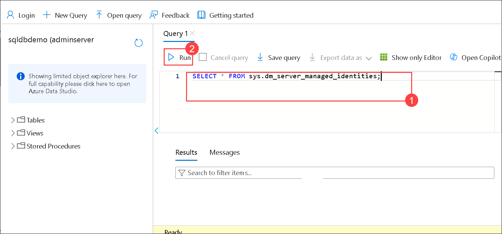
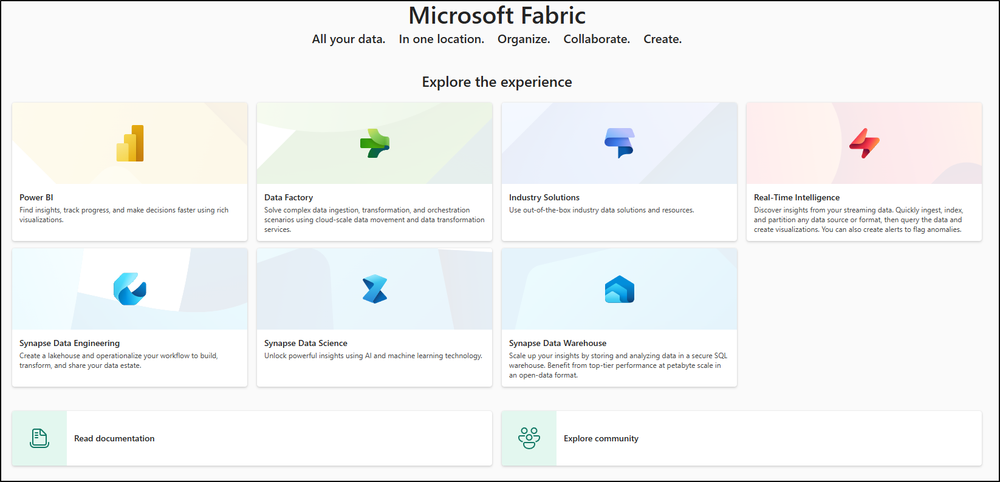
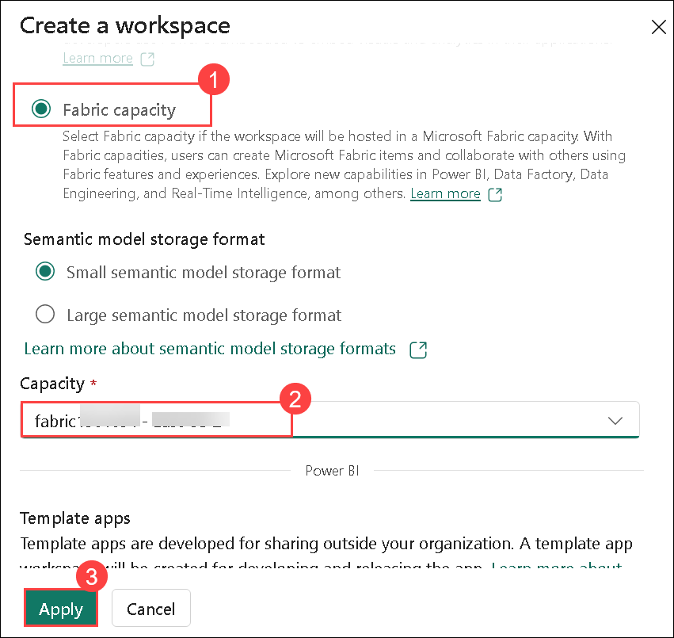
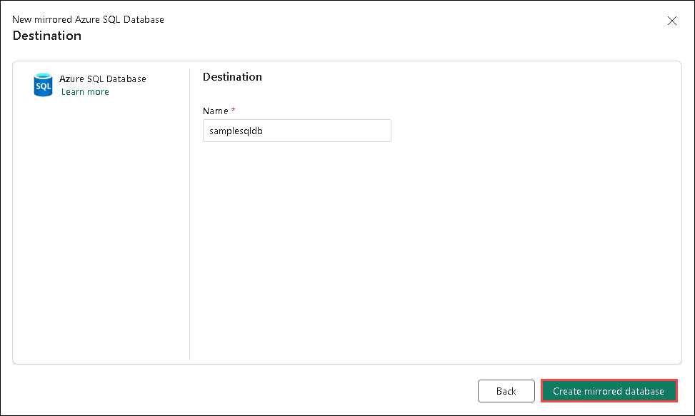

# Lab 01: Configure Microsoft Fabric mirrored databases from Azure SQL Database

In this lab, the focus is on enabling System assigned managed identity (SAMI) for Azure SQL Database to ensure high availability and disaster recovery. The lab guides you through the process of connecting to your Azure SQL logical server using SQL Server Management Studio (SSMS). You will configure a mirrored Azure SQL Database to provide a reliable failover solution. The mirroring setup ensures that your data is synchronized between the primary and mirrored databases, providing resilience in case of failure. By completing this lab, you gain practical knowledge of how to enhance the availability and security of your Azure SQL Database.

## Task 01:  Enable SAMI of your Azure SQL logical server

1. In the Azure portal, search for **SQL servers (1)** and choose **SQL servers (2)**.
   
   

1. Select the SQL servers **sqlserver-<inject key="DeploymentID" enableCopy="false"/>**  

   

1. In the resource menu, go to **Identity(1)** under the **Security** section, **toggle on(2)** the System Assigned Managed Identity (SAMI), and **save(3)** the changes.

   


1. From the left pane, select the **Query Editor (Preview)** and log in to the SQL Server using server authentication.

   - Username : <inject key="SQL Server Username" enableCopy="false"/> 

   - Password : <inject key="SQL Server Password" enableCopy="false"/>

     

2. Ensure that the SAMI is set as the primary identity. Verify this by running the following T-SQL query:

   ```
   SELECT * FROM sys.dm_server_managed_identities;
   ```

   

1. In the Windows VM search bar, type **SSMS (1)** and **Select SQL server management studio (SSMS)(2)** to open SQL Server Management Studio.

    
 
1. In the Connect to Server pane, log in to the SQL Server using the credentials below, and click **Connect (5)** :

   - Server name : **sqlserver-<inject key="DeploymentID" enableCopy="false"/>.database.windows.net (1)**

   - Authentication : **SQL Server Authentication (2)**

   - Login : **<inject key="SQL Server Username" enableCopy="false"/> (3)**

   - Password : **<inject key="SQL Server Password" enableCopy="false"/> (4)**

     

1. Open a **New Query** from top menu to assign permissions. 
 
   

1. Create a SQL-authenticated login named fabric_login. Use a strong password of your choice. Run the following T-SQL script in the master database by clicking Execute: 

   >**Note :** Provide the "strong password" as desired

     ```
     CREATE LOGIN fabric_login WITH PASSWORD = '<strong password>';
     ALTER SERVER ROLE [##MS_ServerStateReader##] ADD MEMBER fabric_login;
     ```

   

4. You will be able to see a **fabric_login** login account that's been created under **logins**. 

    

    >**Note :** If you are unable to see the fabric_login just refresh the pane.

     

1. Open a new query window,  and create a database user connected to the login:

     ```
     CREATE USER fabric_user FOR LOGIN fabric_login;
     ```

## Task 02: Create a mirrored Azure SQL Database

1. Open the ```https://app.fabric.microsoft.com```, You will be navigated to the **Fabric Home**.

    

1.  Now, select **Workspaces** and click on **+ New workspace**:

     

2. Fill out the **Create a workspace** form with the following details:

   - **Name:** Enter **fabric-<inject key="DeploymentID" enableCopy="false"/>**.

      
   
      >**Note**: The user ID will be unique for each user, and the workspace name must also be unique. Ensure that a green check mark with **"This name is available"** appears below the Name field.

1. If you would like, you can enter a **Description** for the workspace. This is an optional field.

1. Click on **Advanced** to expand the section and Under **License mode**, select **Fabric capacity (1)**, Under **Capacity** Select available **fabric<inject key="DeploymentID" enableCopy="false"/> (2)** and click on **Apply (3)** to create and open the workspace.

    

    >**Note:** If the **Introducing task flows** dialog opens, click on **Got it**.

    

1. Navigate to the workspace. Select the **+ New item** icon.

    

1. Scroll to the Data Warehouse section and then select **Mirrored Azure SQL Database**.

   

1. Select a Azure SQL Database under **choose a database connection to get started**.

   

2. Select New connection, enter the connection details to the Azure SQL Database.

   - Server : **sqlserver-<inject key="DeploymentID" enableCopy="false"/>.database.windows.net (1)**
   - Database : **samplesqldb (2)**
   - Connection: Create new connection.
   - Connection name: **sqlserver-<inject key="DeploymentID" enableCopy="false"/>.database.windows.net;samplesqldb (3)**
   - Authentication kind: **Basic (SQL Authentication) (4)**
   - Username : **<inject key="SQL Server Username" enableCopy="false"/> (5)**
   - Password : **<inject key="SQL Server Password" enableCopy="false"/> (6)**
   - Select **Connect (7)**.

     

 3. On the **Choose Data** pane, verify that all checkboxes are selected by default. Once confirmed, click on **Connect**.
 

     

 1. On the Destination pane, ensure **samplesqdb** database is present and click on **Create mirrored database**.

     

 ## Task-03: Initiate, Monitor, and Secure Microsoft Fabric Mirroring for Azure SQL Databases


1. Choose the Mirror database option to initiate the mirroring process.

    

   >**Note**: Please wait for 2 to 5 minutes. After that, click on "Monitor Replication" to check the status.

3. After a few moments, the status will change to Running, indicating that the tables are being synchronized.

     

   >**Note:** Click on Refresh to see the synchronized tables

4. Navigate back to the SQL Server Management Studio (SSMS) that is already connected to the database, to run the query.

5. Right-click on your database and select **New Query**. Paste the following code and execute it by clicking the **Execute** button.
  
   
  
   ```
   CREATE TABLE [dbo].[YourNewTableName] (
    [Id] INT IDENTITY(1,1) PRIMARY KEY, -- Auto-increment primary key
    [Column1] NVARCHAR(100) NOT NULL,  -- Example column
    [Column2] INT NULL,                -- Example column
    [Column3] DATETIME DEFAULT GETDATE() -- Example column with default value
    );

    ```

    

5. The newly created table will appear in the list of tables in the Database Explorer.

      

6. Go back to the Fabric environment, navigate to the mirrored database, and refresh the view. The newly created table should now appear.

   
     
   >**Note**: If the tables and replication status do not appear immediately, wait a few seconds and refresh the panel again.

7. After the initial table copy is complete, a date will appear in the **Last Completed** column.

# Review

In this lab, you have learned how to enable System assigned managed identity (SAMI) by connecting via SQL Server Management Studio (SSMS). After connecting to the master database, you proceed to set up and configure a mirrored Azure SQL Database. This setup ensures high availability by creating a replica of the database for failover scenarios. The process involves configuring database mirroring to maintain data synchronization between the primary and mirrored databases. Overall, the lab helps you establish disaster recovery and resilience for your Azure SQL Database environments.


