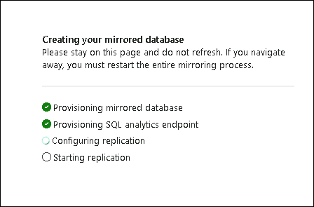

# Lab 01: Configure Microsoft Fabric mirrored databases from Azure SQL Database

## Lab Scenario

In this lab, you will configure mirrored databases within Microsoft Fabric using Azure SQL Database. You are tasked with setting up a high-availability solution for your organization’s critical data by enabling data replication across multiple regions. By the end of the lab, you will have mirrored your Azure SQL databases to ensure seamless data access, failover support, and disaster recovery capabilities within your Microsoft Fabric environment.

## Lab objectives
In this lab, you will complete the following tasks:

- Task 01:  Enable SAMI of your Azure SQL logical server
- Task 02: Create a mirrored Azure SQL Database
- Task 03: Initiate, Monitor, and Secure Microsoft Fabric Mirroring for Azure SQL Databases

## Estimated time: 50 minutes

### Task 01: Enable SAMI of your Azure SQL logical server

In this task, you will enable the **System assigned managed Identity (SAMI)** feature on your Azure SQL logical server to allow automatic scaling and management of your database instances within the Microsoft Fabric environment.

1. In the Azure portal, search for **SQL servers (1)** and choose **SQL servers (2)**.
   
   

1. Select the SQL servers **sqlserver-<inject key="DeploymentID" enableCopy="false"/>**  

   

1. In the resource menu, go to **Identity (1)** under the **Security** section, **ON (2)** the System Assigned Managed Identity (SAMI), and **Save (3)** the changes.

   

   >**Note**: **Please wait until SAMI is turned on; it might take some time.**

1. Under **Security**, Choose **Networking (1)** and **add a firewall rule (2)**.

    


1. Fill in the details as shown below:

   - Rule name : `Allowall` (1)

   - Start IPV4 address : `0.0.0.0` (2)

   - End IPV4 address : `255.255.255.255` (3)

      
  
1. In the **Search resources, services, and docs** bar in Azure, search for **SQL database (1)** and **select it (2)**

     


1. Select the **samplesqldb** database.

     

1. From the left pane, select the **Query Editor (Preview)** and log in to the SQL Server using server authentication.

   - **Username : <inject key="SQL Server Username" enableCopy="true"/>**

   - **Password : <inject key="SQL Server Password" enableCopy="true"/>**

     

1. Ensure that the SAMI is set as the primary identity. Verify this by running the following T-SQL query:

   ```
   SELECT * FROM sys.dm_server_managed_identities;
   ```

   

1. In the Windows VM search bar, type **SSMS** and select **SQL Server Management Studio (SSMS)** to open it.

    
 
1. In the Connect to Server pane, log in to the SQL Server using the credentials below, and click **Connect (5)** :

   - Server name : **sqlserver-<inject key="DeploymentID" enableCopy="false"/>.database.windows.net (1)**

   - Authentication : **SQL Server Authentication (2)**

   - Login : **<inject key="SQL Server Username" enableCopy="false"/> (3)**

   - Password : **<inject key="SQL Server Password" enableCopy="false"/> (4)**

     

1. Click on **New Query** in the toolbar to run the query.
 
   

1. Create a SQL-authenticated login named **fabric_login** with a strong password. Run the T-SQL script in the master database by clicking **Execute**. 

   >**Note :** Provide the "strong password" as desired

     ```
     CREATE LOGIN fabric_login WITH PASSWORD = '<strong password>';
     ALTER SERVER ROLE [##MS_ServerStateReader##] ADD MEMBER fabric_login;
     ```

   

1. You will be able to see a **fabric_login** login account that's been created under **logins**. 

    

    >**Note :** If you are unable to see the fabric_login just refresh the pane.

     

1. In the same query, paste the code, highlight it, and execute the highlighted section. 

     ```
     CREATE USER fabric_user FOR LOGIN fabric_login;
     ```

     

### Task 02: Create a mirrored Azure SQL Database
 
In this task, you will create a mirrored Azure SQL database by setting up replication between a source and target database, ensuring high availability and data redundancy within your Microsoft Fabric environment.

1. Open the ```https://app.fabric.microsoft.com```, You will be navigated to the **Fabric Home**.

    

1.  Now, select **Workspaces** and click on **+ New workspace**:

     

1. Fill out the **Create a workspace** form with the following details:

   - **Name:** Enter **fabric-<inject key="DeploymentID" enableCopy="false"/>**.

      
   
      >**Note**: The user ID will be unique for each user, and the workspace name must also be unique. Ensure that a green check mark with **"This name is available"** appears below the Name field.

1. If you would like, you can enter a **Description** for the workspace. This is an optional field.

1. Click on **Advanced** to expand the section and Under **License mode**, select **Fabric capacity (1)**, Under **Capacity** Select available **fabric<inject key="DeploymentID" enableCopy="false"/> EAST US (2)** and click on **Apply (3)** to create and open the workspace.

    

    >**Note:** If the **Introducing task flows** dialog opens, click on **Got it**.

    

1. Navigate to the workspace. Select the **+ New item** icon.

    

1. Scroll to the Data Warehouse section and then select **Mirrored Azure SQL Database**.

   

1. Select a Azure SQL Database under **choose a database connection to get started**.

   

1. Select New connection, enter the connection details to the Azure SQL Database.

   - Server : **sqlserver-<inject key="DeploymentID" enableCopy="false"/>.database.windows.net (1)**
   - Database : **samplesqldb (2)**
   - Connection: Create new connection.
   - Connection name: **sqlserver-<inject key="DeploymentID" enableCopy="false"/>.database.windows.net;samplesqldb (3)**
   - Authentication kind: **Basic (SQL Authentication) (4)**
   - Username : **<inject key="SQL Server Username" enableCopy="false"/> (5)**
   - Password : **<inject key="SQL Server Password" enableCopy="false"/> (6)**
   - Select **Connect (7)**.

     

 1. On the **Choose Data (2)** pane, verify that all checkboxes are selected by default. Once confirmed, click on **Connect (3)**.
 
     

 1. On the Destination pane, ensure **samplesqdb (1)** database is present and click on **Create mirrored database (2)**.

     

### Task 03: Initiate, Monitor, and Secure Microsoft Fabric Mirroring for Azure SQL Databases

In this task, you will start the mirroring process for Azure SQL databases, monitor the replication status to ensure synchronization, and apply security measures to protect data during the mirroring process within Microsoft Fabric.

1. Creating your mirrored database.

    

   >**Note**: Please wait for 2 to 5 minutes. 

1. After a few moments, the status will change to Running, indicating that the tables are being synchronized.

     

   >**Note:** Click on Refresh to see the synchronized tables

4. Navigate back to the SQL Server Management Studio (SSMS) that is already connected to the database, to run the query.

5. Right-click on your database and select **New Query**. Paste the following code and execute it by clicking the **Execute** button.
  
   
  
   ```
   CREATE TABLE [dbo].[YourNewTableName] (
    [Id] INT IDENTITY(1,1) PRIMARY KEY, -- Auto-increment primary key
    [Column1] NVARCHAR(100) NOT NULL,  -- Example column
    [Column2] INT NULL,                -- Example column
    [Column3] DATETIME DEFAULT GETDATE() -- Example column with default value
    );

    ```

    

5. The newly created table will appear in the list of tables in the Database Explorer.

      

6. Go back to the Fabric environment, navigate to the mirrored database, and refresh the view. The newly created table should now appear.

   
     
   >**Note**: If the tables and replication status do not appear immediately, wait a few seconds and refresh the panel again.

7. After the initial table copy is complete, a date will appear in the **Last Completed** column.

## Summary

In this lab, you have accomplished the following:

- **Enabled SAMI** on your **Azure SQL logical server** for secure authentication and access to Azure resources.
- **Created a mirrored Azure SQL Database** to ensure high availability and data replication.
- **Initiated, monitored, and secured Microsoft Fabric mirroring** for Azure SQL Databases to ensure data consistency and real-time synchronization.


## Congratulations! You have successfully finished the lab. Click Next >> to Proceed to the next lab.

