# Configure Your Azure Cosmos DB Account

## Ensure the Source Azure Cosmos DB Account is Correctly Configured

1. In the Azure portal home, locate the search bar at the top of the screen. 

2. Type "Azure Cosmos DB" and press Enter. In the search results, select Azure Cosmos DB account.

     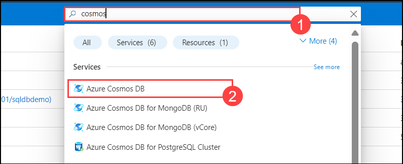

3. From the left hand side , Choose **data explorer(1)** and choose **launch quick start(2)**

      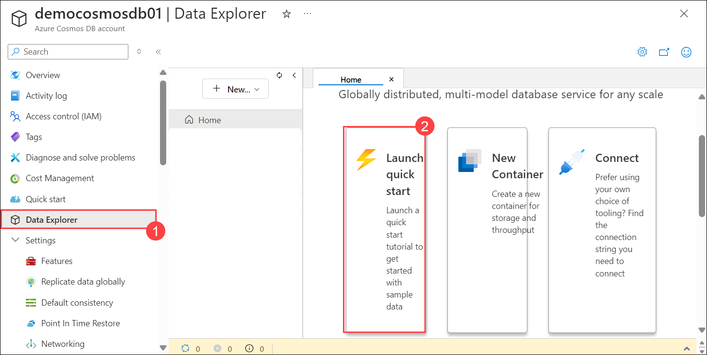

4. This action will create a sample database. Leave all the settings as default, then click **OK** to proceed, Once after its created you can see the tables that's created

    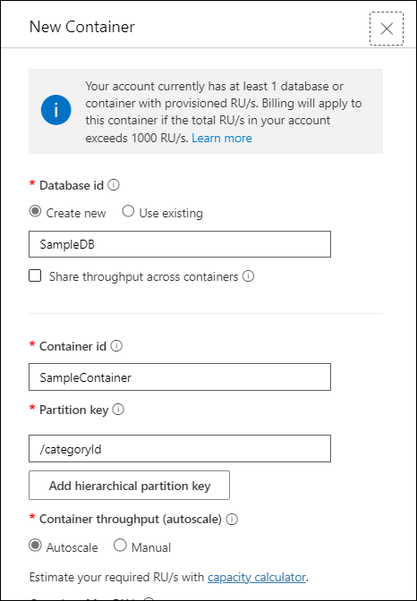

5. Ensure that the networking options are set to **Public network access for all networks** from the networking tab.

6. On the left hand pane , select **identity(1)** and Enable system assigned status **On(2)** and then click on **save(3)** and when prompted click on yes

   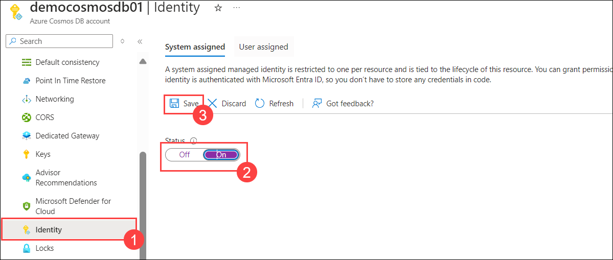
   
## Create a Mirrored Database

1. Navigate to the **Fabric portal** home.

    

2. Open an existing workspace **fabric-<inject key="DeploymentID" enableCopy="false"/>**

3. In the navigation menu, select **+New Item**.

   

4. Select **Mirrored Azure Cosmos DB (Preview)**

    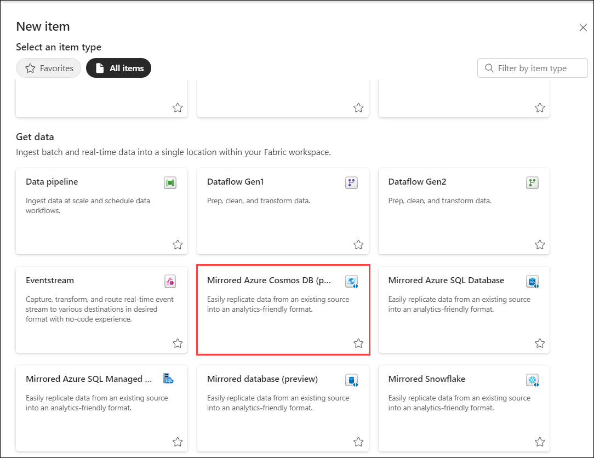

## Connect to the Source Database

1. In the **New Connection** section, select **Azure Cosmos DB v2**.

   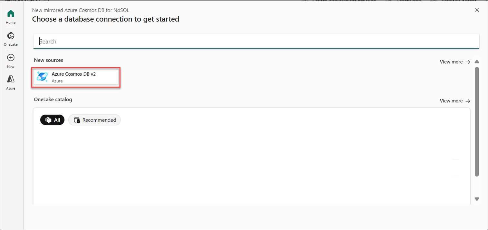

2. Provide credentials for the Azure Cosmos DB for NoSQL account including:

     - **Azure Cosmos DB endpoint**: URL endpoint for the source account.
     - **Connection name**: Unique name for the connection.
     - **Authentication kind**: Select **Account key**.
     - **Account Key**: Read-write key for the source account.
     - Select **Connect**. Then, select a database to mirror.

        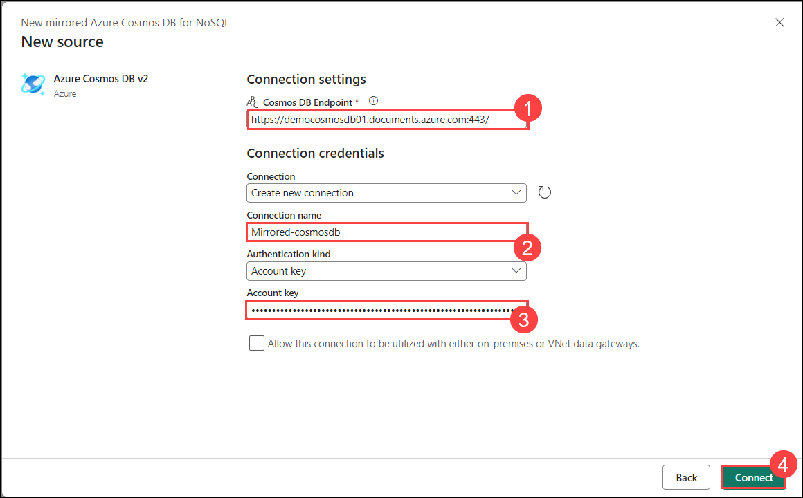

3. Under choose data , click on next and **connect**

    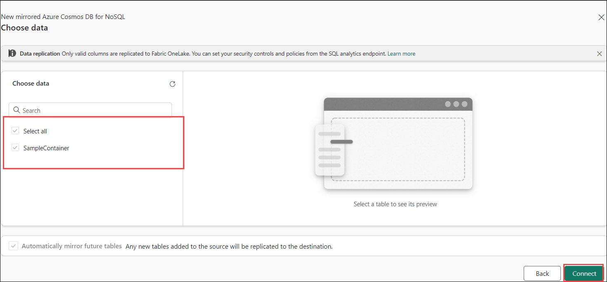
  
4. Under destination , Give a name **Mirrored-SampleDB** and click on create 

     

   >**Note**: All containers in the database will be mirrored.

# Start the Mirroring Process and Monitor Fabric Mirroring

1. Select **Monitor Replication**. Mirroring will now begin.

   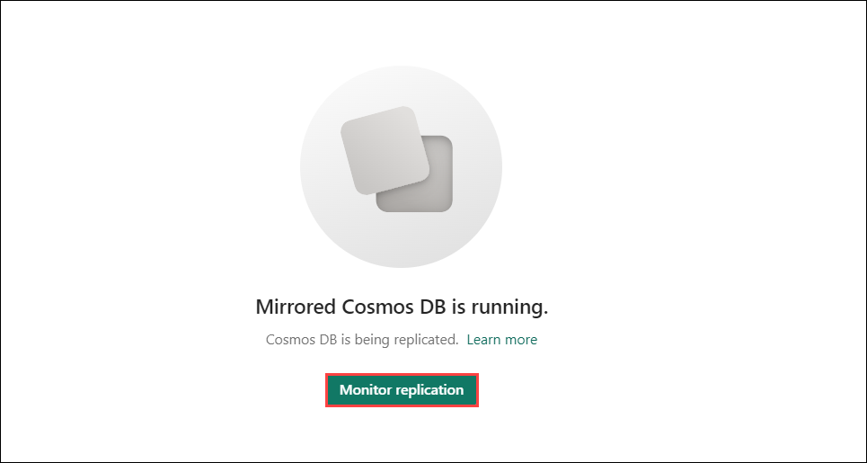

>**Note**: Wait for 2 to 5 minutes, then select **Monitor replication** to see the status of the replication action.

2. After a few minutes, the status should change to **Running**, indicating that the containers are being synchronized.

    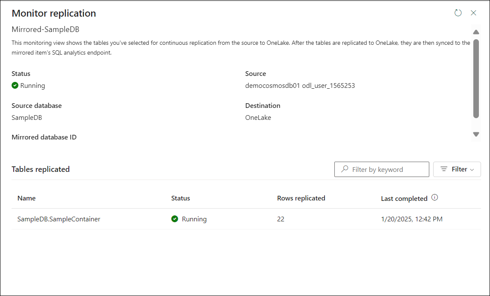


   - **Tip**: If you can't find the containers and the corresponding replication status, refresh the pane after a few seconds. In rare cases, transient error messages may appear; you can safely ignore them and refresh.

>**Note**: When the mirroring finishes the initial copying of the containers, a date will appear in the **Last Refresh** column. If data was successfully replicated, the **Total Rows** column will show the number of items replicated.


# Query the Source Database from Fabric

1. Navigate to the mirrored database in the Fabric portal.


2. Select **View**, then **Source database**. This action opens the Azure Cosmos DB data explorer with a read-only view of the source database.

    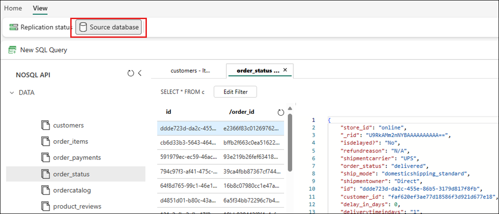

3. Select a container, then open the context menu and select **New SQL query**.

    
  >**Note**: All the reads on the source database are routed to Azure and will consume Request Units (RUs) allocated on the account.

# Analyze the Target Mirrored Database

1. Navigate to the mirrored database in the Fabric portal.

2. Switch from **Mirrored Azure Cosmos DB** to **SQL Analytics endpoint**.

     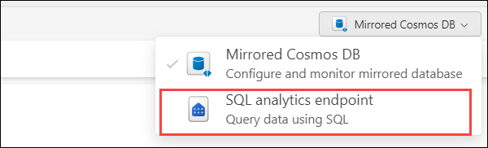


3. Each container in the source database should be represented in the SQL analytics endpoint as a warehouse table.

4. Select any table, open the context menu, then select **New SQL Query**, and select **Select Top 100**.

   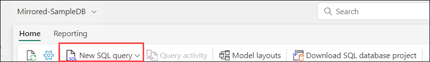

   - Run any query. For example, use:

        ```sql
        SELECT TOP (100) [_rid],
                [id],
                [categoryId],
                [categoryName],
                [sku],
                [name],
                [description],
                [price],
                [tags],
                [_ts]
        FROM [Mirrored-SampleDB].[SampleDB].[SampleContainer]
        ```

     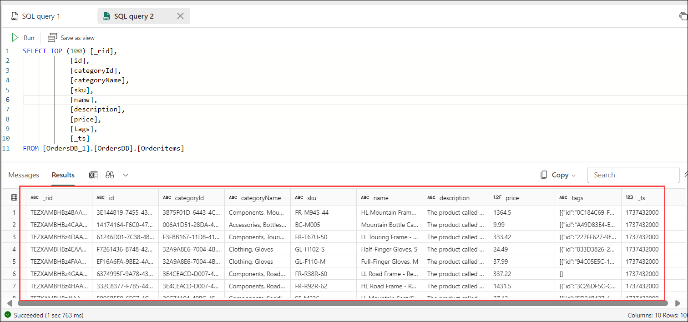

5. The query will execute and return 100 records in the selected table.

6. Open the context menu for the same table, select **New SQL Query**, and write an example query that uses aggregates like **SUM**, **COUNT**, **MIN**, or **MAX**. You can also join multiple tables to execute the query across multiple containers.
   
  
1. Select the query and then select Save as view. Give the view a unique name. You can access this view at any time from the Fabric portal.

   

1. Return back to the mirrored database in the Fabric portal.

1. Select New visual query. Use the query editor to build complex queries.


1. Screenshot of the query editor for both text-based and visual queries in Fabric.


Build BI reports on the SQL queries or views
Select the query or view and then select Explore this data (preview). This action explores the query in Power BI directly using Direct Lake on OneLake mirrored data.
Edit the charts as needed and save the report.
