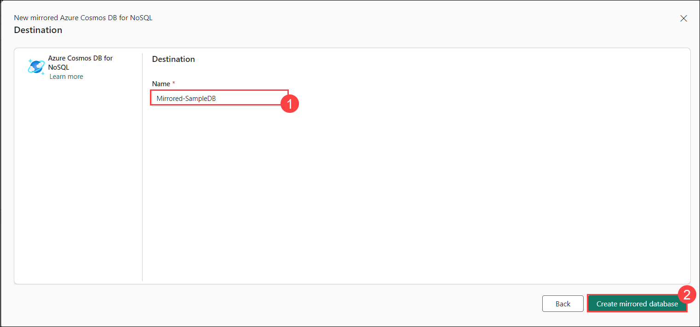

## Lab 02: Configure Microsoft Fabric Mirrored Database from Azure Cosmos DB

In this lab, you will set up an Azure Cosmos DB account and configure a mirrored database in Azure Fabric for data replication. You will link Fabric to the source Cosmos DB and initiate the mirroring process while ensuring proper synchronization by tracking its progress. Once the mirroring process is completed, you will query the source database directly from Fabric. You will then examine the mirrored database to gain insights and verify the replication. Finally, you will explore how to use the mirrored data for reporting and analytics.

### Task 01: Verify the Configuration of the Source Azure Cosmos DB Account

1. In the Azure portal, type **"Azure Cosmos DB" (1)** in the search bar at the top of the page, and select the **Azure Cosmos DB account (2)** from the search results.

   

2. Select **cosmosdb-<inject key="DeploymentID" enableCopy="false"/>**.

3. From the left-hand panel, click on **Data Explorer (1)** and then select **Launch Quick Start (2)**.

   

4. Enter the Database ID as **OrderDB** and the Container ID as **Orderitems**. Leave all other settings at their default values, and click **OK** to proceed. Once the container is created, you will see the tables that were created.

   

5. Next, click on **Launch Quick Start** again and create another container with the ID **Orderstatus**. Select **Use Existing** and choose **OrderDB** from the dropdown menu. Then, click **OK**.

   

6. Ensure that the networking options in the **Networking** tab are set to **Public network access for all networks**.

7. In the left panel, select **Identity (1)**, enable the system-assigned status by switching it to **On (2)**, and then click **Save (3)**. When prompted, click **Yes**.

   

8. Select **Keys** from the left-hand pane, then copy the **endpoint URL** and **primary key** and paste them into a notepad for use in the further steps.

      

9. Now select **Backup & Restore (1)** from the left-hand pane.

     - Click **Change (2)** to modify the Backup policy mode.

     - Choose **Continuous (30 days) (3)**.

     - Click on **Save (4)**

        

   
## Task 02: Set Up a Mirrored Database

1. Go to the **Fabric portal** home page of Power BI.

   

2. Open the existing workspace **fabric-<inject key="DeploymentID" enableCopy="false"/>**.

3. In the navigation menu, click on **+ New Item**.

   

4. From the options, choose **Mirrored Azure Cosmos DB (Preview)**.

   


## Task 03: Connect to the Source Database

1. In the **New Connection** section, choose **Azure Cosmos DB v2**.

   

2. Enter the credentials for your Azure Cosmos DB for NoSQL account, including the following details:

     - **Azure Cosmos DB endpoint**: Paste the endpoint URL that you save in the notepad earlier.

     - **Connection name**: A unique name for this connection.

     - **Authentication kind**: Select
     **Account key**.

     - **Account Key**: Paste the account key that you saved in the notepad earlier.
     
     - Click **Connect**. 

       

   

3. Under the **Choose Data** section, click **Connect**.

    
  
5. In the **Destination** section, enter the name **Mirrored-SampleDB** and click **Create mirrored database**.

     

      > **Note**: All containers within the selected database will be mirrored.

     


## Task 04: Start the Mirroring Process and Monitor Fabric Mirroring

1. Select **Monitor Replication**. Mirroring will now begin.

   

   >**Note**: Wait for 2 to 5 minutes, then select **Monitor replication** to see the status of the replication action.

2. After a few minutes, the status should change to **Running**, indicating that the containers are being synchronized.

   


   - **Tip**: If you can't find the containers and the corresponding replication status, refresh the page after a few seconds. In rare cases, transient error messages may appear; you can safely ignore them and refresh.

     >**Note**: When the mirroring finishes the initial copying of the containers, a date will appear in the **Last Refresh** column. If data was successfully replicated, the **Total Rows** column will show the number of items replicated.


## Task 05: Query the Source Database from Fabric

1. Go to the mirrored database in the Fabric portal.

    

2. Click on **View**, then select **Source Database**. This will open the Azure Cosmos DB data explorer in a read-only mode for the source database.

    

  > **Note**: All read operations on the source database are routed to Azure and will consume Request Units (RUs) allocated to the account.


## Task 06: Analyze the Target Mirrored Database


1. Switch from **Mirrored Azure Cosmos DB** to **SQL Analytics Endpoint**.

     

2. Each container from the source database will appear as a warehouse table in the SQL Analytics Endpoint.

3. Select **Orderstatus**, open the context menu, and click on **New SQL Query**, then choose **Select Top 100**. The query will run and return the top 100 records from the selected table.


4. Next, select **Orderitems**, click **New SQL Query**, and choose **Select Top 100**.

   - Run the following sample query:

        ```sql
         SELECT TOP (100)[_rid],
                           [id],
                   [categoryId],
                 [categoryName],
                          [sku],
                         [name],
                  [description],
                        [price],
                         [tags],
                          [_ts]
         FROM [OrderDB].[OrderDB].[Orderitems]
        ```

     

5. Select **New Visual Query** to open the query editor from the toolbar.    

      

6. Drag and drop both the **Orderstatus** and **Orderitems** tables into the query editor.

     

7. Click the **+** icon in the first query and choose **Merge query as new**.

     

8. For the merge, select **Orderitems** from the right table and choose **id**, then click **OK**.

      

9. Once merged, your visual query will appear as follows:

     

10. On the query editor pane, select **save as view**.

     

11. In the **Save As** window, select **OrderDB (1)** as the schema and name the view as **Merged_orders (2)**, then click **OK (3)**.

     

10. From the toolbar, go to the **Reporting** tab and click on **New Report**.

     

11. When the pop-up appears displaying all available data, click **Continue**.

      

12. When the pop-up appears, select **Try Free** to upgrade to a paid Power BI license.

      

13. Click on **Got it**.

      

12. Expand the **Data Pane** and select the **Sum of _ts**, **categoryid**, and **Sum of price**.

     

13. In the **Visualization Pane**, select the **Clustered Column Chart**.

     

14. Finally, the generated report for **OrderDB** will be displayed. Save the report as **Orders-reports**.

    

    


# Review

  In this lab, you configured your Azure Cosmos DB account and created a mirrored database in Azure Fabric for data replication. You connected Fabric to the source Cosmos DB, started the mirroring process, and monitored its progress. Once synchronized, you queried the source database directly from Fabric. Finally, you analyzed the mirrored database in Fabric for insights and reporting.
