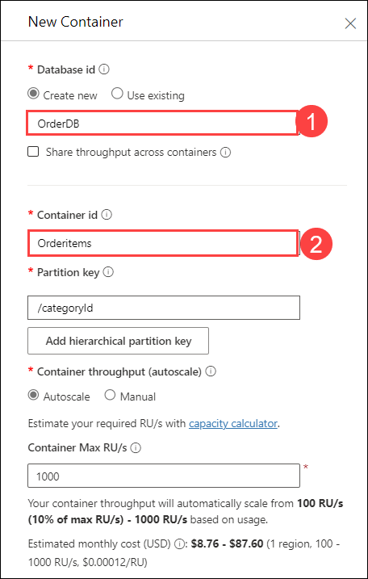

# Lab –02 Configure Microsoft Fabric mirrored database from Azure Cosmos DB

In this lab, you will configure an Azure Cosmos DB account and set up a mirrored database in Azure Fabric for data replication. You will connect Fabric to the source Cosmos DB and initiate the mirroring process, ensuring proper synchronization by monitoring its progress. Once the mirroring is complete, you will query the source database directly from Fabric. You will then analyze the mirrored database to gain insights and validate the replication process. Finally, you will explore how to leverage the mirrored data for reporting and analytics.

## Task 1 : Ensure the Source Azure Cosmos DB Account is Correctly Configured

1. In the Azure portal, locate the search bar at the top of the screen and Type "Azure Cosmos DB", in the search results, select Azure Cosmos DB account.

   

1. Select cosmosdb-<inject key="DeploymentID" enableCopy="false"/>  

3. From the left pane, Choose **data explorer(1)** and choose **launch quick start(2)**

      

4. Give the Databaseid name as **OrderDB** and container id as **Orderitems** . Leave all the settings as default, then click **OK** to proceed, Once after its created you can see the tables that's created

    


5. Again ,Choose **launch quick start** and create an other container id as **Orderstatus**. Select use existing and from the drop-down choose **OrderDB**. Then click **OK**

      

5. Ensure that the networking options under settings are set to **Public network access for all networks** from the networking tab.

6. On the left pane , select **identity (1)** and Enable system assigned status **On (2)** and then click on **save (3)** and when prompted click on **yes**.

   
   
## Task 2 : Create a Mirrored Database

1. Navigate to the **Fabric portal** home.

    

2. Open an existing workspace **fabric-<inject key="DeploymentID" enableCopy="false"/>**

3. In the navigation menu, select **+ New Item**.

   

4. Select **Mirrored Azure Cosmos DB (Preview)**

    

## Task 3 : Connect to the Source Database

1. In the **New Connection** section, select **Azure Cosmos DB v2**.

   

2. Provide credentials for the Azure Cosmos DB for NoSQL account including:

     - **Azure Cosmos DB endpoint**: URL endpoint for the source account.
     - **Connection name**: Unique name for the connection.
     - **Authentication kind**: Select **Account key**.
     - **Account Key**: Primary key
     - Select **Connect**. Then, select a database to mirror.

       

       **Note :** From Azure portal, Navigate to your Cosmos DB, select keys from the left pane and copy the key and URL End point. 

       

1. In New connection pane, select OrderDB and click on **Connect**.
3. Under choose data , click on **connect**

    
  
4. Under destination , Give a name **Mirrored-SampleDB** and click on create 

     

     >**Note**: All containers in the database will be mirrored.

     > **Note :** If see error related to Continous backup needs to be enabled, perform the below steps and click on **Save (4)** then reperform from step 1.

      - Navigate to your Azure Cosmos DB and select **Backup & Restore (1)** from the left pane.
      - Click on **Change (2)** to change the Backup policy Mode.
      - Select **Continous (30 days) (3)**

        


## Task 4 : Start the Mirroring Process and Monitor Fabric Mirroring

1. Select **Monitor Replication**. Mirroring will now begin.

   

>**Note**: Wait for 2 to 5 minutes, then select **Monitor replication** to see the status of the replication action.

2. After a few minutes, the status should change to **Running**, indicating that the containers are being synchronized.

   


   - **Tip**: If you can't find the containers and the corresponding replication status, refresh the pane after a few seconds. In rare cases, transient error messages may appear; you can safely ignore them and refresh.

     >**Note**: When the mirroring finishes the initial copying of the containers, a date will appear in the **Last Refresh** column. If data was successfully replicated, the **Total Rows** column will show the number of items replicated.


## Task 5 : Query the Source Database from Fabric

1. Navigate to the mirrored database in the Fabric portal.

    

2. Select **View**, then **Source database**. This action opens the Azure Cosmos DB data explorer with a read-only view of the source database.

    

    
  >**Note**: All the reads on the source database are routed to Azure and will consume Request Units (RUs) allocated on the account.

## Task 6 : Analyze the Target Mirrored Database

1. Navigate to the mirrored database in the Fabric portal.

2. Switch from **Mirrored Azure Cosmos DB** to **SQL Analytics endpoint**.

     


3. Each container in the source database should be represented in the SQL analytics endpoint as a warehouse table.

4. Select Orderstatus, open the context menu, then select **New SQL Query**, and select **Select Top 100**.The query will execute and return 100 records in the selected table . 

   - Now, Select Orderitems then select **New SQL Query**, and select **Select Top 100**.

   - Run any query. For example, use:

        ```sql
          SELECT TOP (100) [_rid],
                         [id],
                         [categoryId],
                         [categoryName],
                         [sku],
                         [name],
                         [description],
                         [price],
                         [tags],
                         [_ts]
          FROM [OrderDB].[OrderDB].[Orderitems]
        ```

     


1. Return back to the SQL Analytics Endpoint in the Fabric portal.

1. Select **New visual query**. Use the query editor .

     

1. Drag and Drop the orderstatus and orderitem tables into the right query editor

     

1. Click on the **+** icon from the first query and choose **Merge query as new**.

     

1. From the right table for merge choose **Orderitems** and select **id** and click on **ok**.

      

1. The visual query once merged

     


1. From the Tool bar choose **reporting** tab and click on **New report**.

     

1. When the New data with all avaialble data. Pop-up appears click on **continue**.

      

1. Expand the Data Pane, Select Sum of _ts, categoryid and sum of price

     

1. From the visualization pane, choose Clustered Column chart

     


1. The final report of the orderDB .Save as **Orders-reports**

    

    


# Review

  In this lab, you configured your Azure Cosmos DB account and created a mirrored database in Azure Fabric for data replication. You connected Fabric to the source Cosmos DB, started the mirroring process, and monitored its progress. Once synchronized, you queried the source database directly from Fabric. Finally, you analyzed the mirrored database in Fabric for insights and reporting.
