# Lab 03: Configure Microsoft Fabric mirrored databases from Azure SQL Managed Instance (Preview)

## Lab Scenario

In this lab, you will configure mirrored databases within Microsoft Fabric using Azure SQL Managed Instance (Preview). Your goal is to set up a high-availability solution by replicating data across multiple Azure SQL Managed Instance instances. This will ensure low-latency access to data and provide disaster recovery capabilities. By the end of this lab, you will have successfully mirrored your Azure SQL Managed Instance databases in Microsoft Fabric, enabling seamless data synchronization, high availability, and improved fault tolerance.

## Lab objectives
In this lab, you will complete the following tasks:

- Task 01: Enable System Assigned Managed Identity (SAMI) of Your Azure SQL Managed Instance
- Task 02: Create a Mirrored Azure SQL Managed Instance Database
- Task 03: Start the Mirroring Process and Monitor Fabric Mirroring

## Estimated time: 40 minutes

### Task 01: Enable System Assigned Managed Identity (SAMI) of Your Azure SQL Managed Instance

In this task, you will enable the System Assigned Managed Identity (SAMI) for your Azure SQL Managed Instance to securely authenticate and access other Azure resources.


 1.  Navigate to the Azure Portal, search for **SQL Managed Instance (1)**, and select **SQL Managed Instance (2)**.

     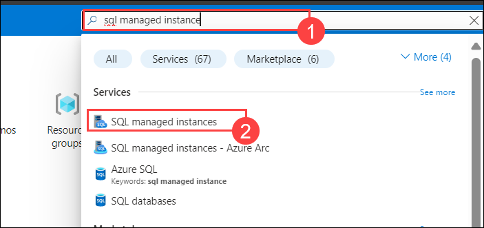

 2. Select **sqlmi-<inject key="DeploymentID" enableCopy="false"/>**

 3. Navigate to **Identity** under the **Security** section in the resource menu. Then, under **System-assigned managed identity**, set the **Status** to **On** and click on **Save**.

      

4. On the **Networking** page, under **Security**, **Copy the public endpoint** and paste it into a notepad. You will need it later to create the mirrored database in Fabric.

   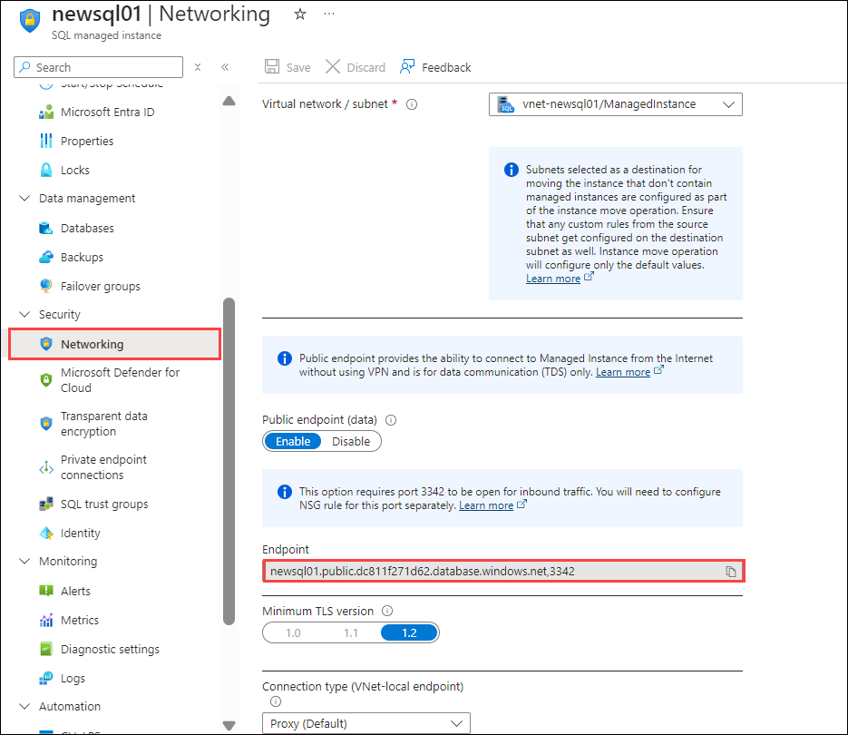

5. Open SQL Server Management Studio (SSMS) and disconnect the previous connection from Object Explorer.

    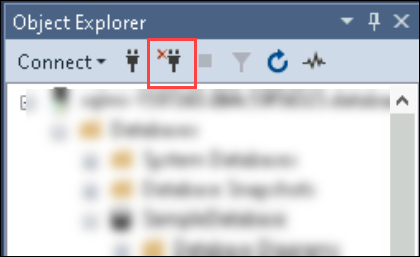

6. Connect to your Azure SQL Managed Instance using SQL Server Management Studio (SSMS) and connect to the  database add the below creds :

   - Server name : **<inject key="SqlmI-URL" enableCopy="false"/> (3)**

   - Authentication : **SQL Server Authentication (2)**

   - Login : **<inject key="Sqlmi administrator login" enableCopy="false"/> (3)**

   - Password : **<inject key="Sqlmi administrator password" enableCopy="false"/> (4)**
     
       

7. Click on **New Query** in the toolbar to run the query.
 
   

8. Expand the **SampleDatabase**, then right-click on it and select **New Query** to open a new query window.


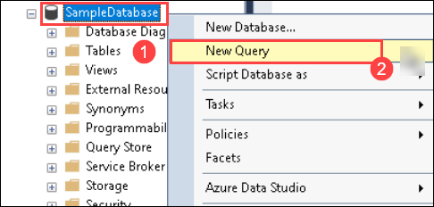

9. Ensure that SAMI is set as the primary identity. To verify, run the following T-SQL query: **Paste the query into the editor (1)**, click **Execute (2)**, and check the results pane to confirm that the primary identity is set to 1. This is essential for database mirroring.

   ```
   SELECT * FROM sys.dm_server_managed_identities;
   ```

   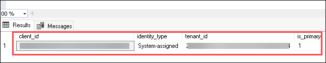

10. In the same query window, run the following command to create a `Sales` table in the `SampleDatabase`, which will be used for database mirroring.

    ```
    CREATE TABLE Sales (
    SaleID INT IDENTITY(1,1) PRIMARY KEY,
    ProductName VARCHAR(100),
    QuantitySold INT,
    SaleDate DATE,
    SaleAmount DECIMAL(10, 2)
   );
   ```

11. You can insert 50 rows of data into the `Sales` table. Below is an example that generates sales data:

    ```
    DECLARE @i INT = 1;

    WHILE @i <= 50
    BEGIN
    INSERT INTO Sales (ProductName, QuantitySold, SaleDate, SaleAmount)
    VALUES 
    (
        'Product ' + CAST(@i AS VARCHAR),               
        FLOOR(RAND() * 10) + 1,                         
        DATEADD(DAY, -(@i), GETDATE()),                
        ROUND(RAND() * 100 + 10, 2)                     
    );

    SET @i = @i + 1;
    END

   ```

## Task 02: Create a Mirrored Azure SQL Managed Instance Database

In this task, you will create a mirrored database on your Azure SQL Managed Instance, enabling high availability and disaster recovery by replicating data. 

1. Navigate to the **Fabric portal** home.

    

2. Open an existing workspace **fabric-<inject key="DeploymentID" enableCopy="false"/>**

3. In the navigation menu, select **+ New Item**.

   

4. Select **Mirrored Azure SQL Managed Instance (Preview)**.

    

5. Under **New sources**, select **Azure SQL Managed Instance**.

    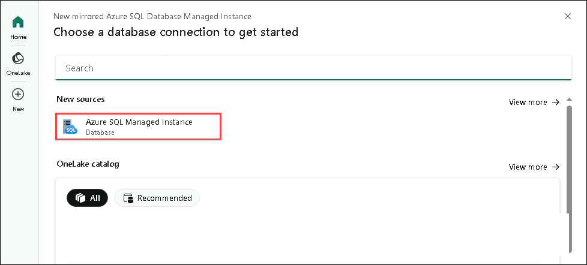


   >**Note**: You can't use existing connections of type "SQL Server". Only connections of type "SQL Managed Instance" are supported for mirroring Azure SQL Managed Instance data.


6. Select **New connection**, and enter the following details:

     - **Server** : Paste the public endpoint that you copied and saved in the notepad during the previous steps (1)

     - **Database** : `SampleDatabase`(2)

     - **Connection** : Create a new connection.

     - **Connection name** : `newconnection`(3)
        .
     - **Authentication kind** : Basic 

     - **Username** : **<inject key="Sqlmi administrator login" enableCopy="false"/>**(4)

     - **Password** : **<inject key="Sqlmi administrator password" enableCopy="false"/>**(5)
       
     - Select **Connect**(6)
       

       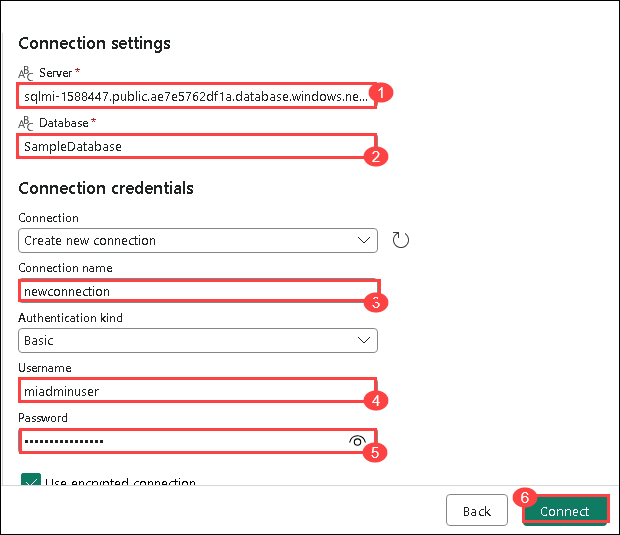

 7. Review the available databases by selecting **Databases** from the list. You will see the database that is selected by default. Click on **Connect**.

       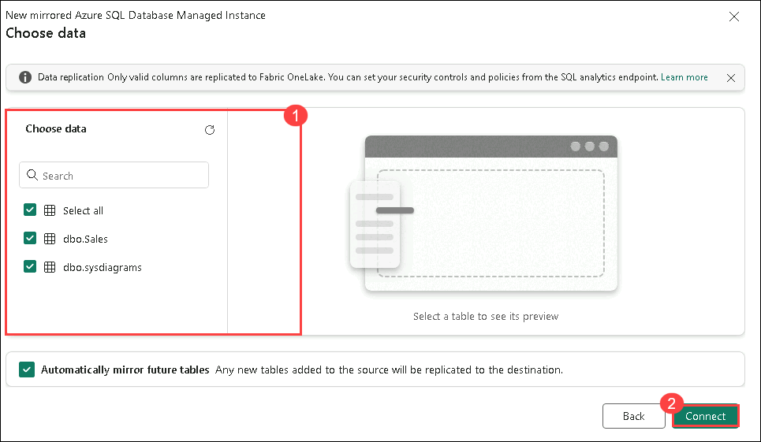

8. Under the destination tab, leave the name as default and select the option to create mirrored databases.

    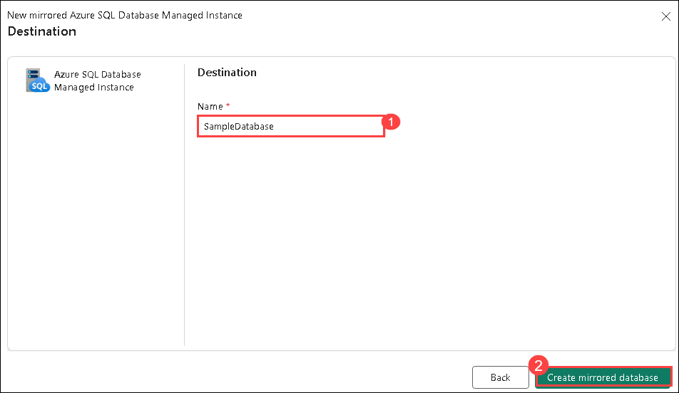

## Task 03: Start the Mirroring Process and Monitor Fabric Mirroring

In this task, you will initiate the database mirroring process and monitor the status and synchronization of the mirrored databases in Microsoft Fabric.


1. The **Monitor Replication** screen will allow you to mirror all data in the database by default.

    >**Note**:After 2-5 minutes, select **Monitor Replication** to see the replication status.

    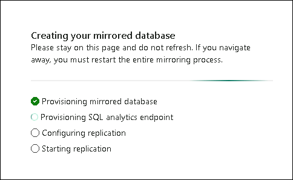

2. The status should change to **Running**, which means the tables are being synchronized.

    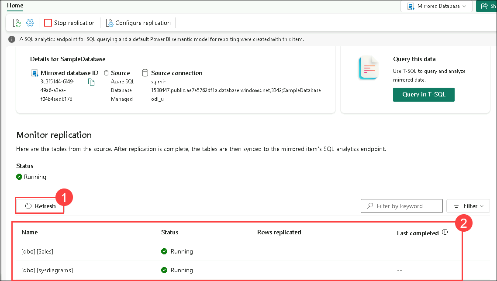

3. Replicating Status:
   
      - **Running** – Replication is currently running, bringing snapshot and change data into OneLake.
      - **Running with warning** – Replication is running with transient errors.
      - **Stopping/Stopped** – Replication is stopped.
      - **Error** – Fatal error in replication that can't be recovered.
    >**Note**: If you don't see the tables and corresponding replication status, wait a few seconds and refresh the pane.

4. When the initial copying of the tables is finished, a date will appear in the **Last refresh** column.

5. Choose **Query in T-SQL**.

    

6. Navigate to the query and expand the **dbo** schema. Then, expand the **Tables** section and select the **Sales** table in the query editor pane to view the data preview.
 
     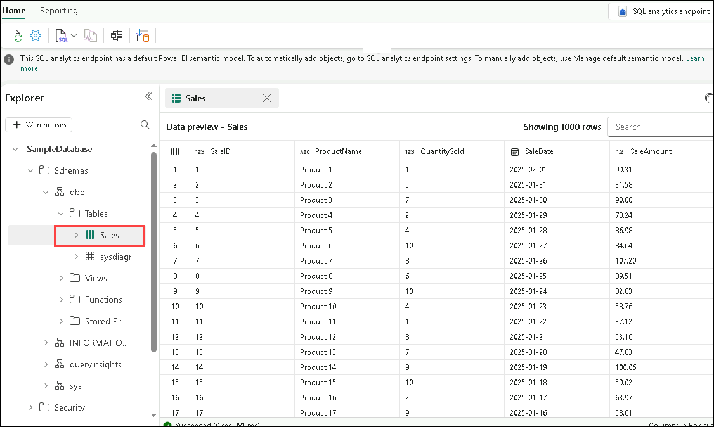


7. Open a **New SQL query** window from the toolbar.

     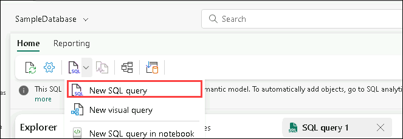

8. Run the sample query to determine the number of rows that have been replicated and the time of the last ingestion.

    ```
    -- Query to get the number of rows and the last ingestion date

    SELECT 
        COUNT(*) AS TotalRows,                     
        MAX(SaleDate) AS LastIngestionDate        
    FROM 
        Sales;
    ```

   


### Summary:

In this lab, you have accomplished the following:

- **Enabled System Assigned Managed Identity (SAMI)** for your **Azure SQL Managed Instance** to securely authenticate and access Azure resources.
- **Created a mirrored Azure SQL Managed Instance database** to ensure high availability and data replication.
- **Started the mirroring process** and **monitored Fabric mirroring** to ensure successful synchronization and data consistency.

### Congratulations! You have successfully finished the lab. Click Next >> to Proceed to the next lab.
