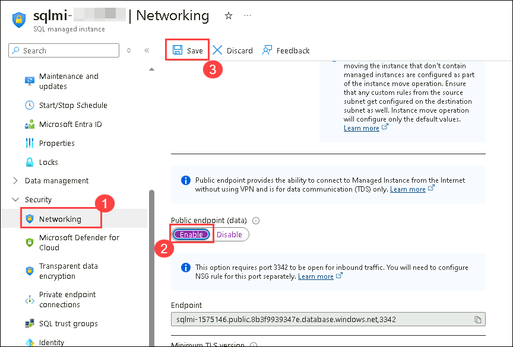
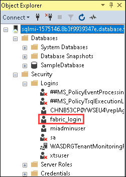
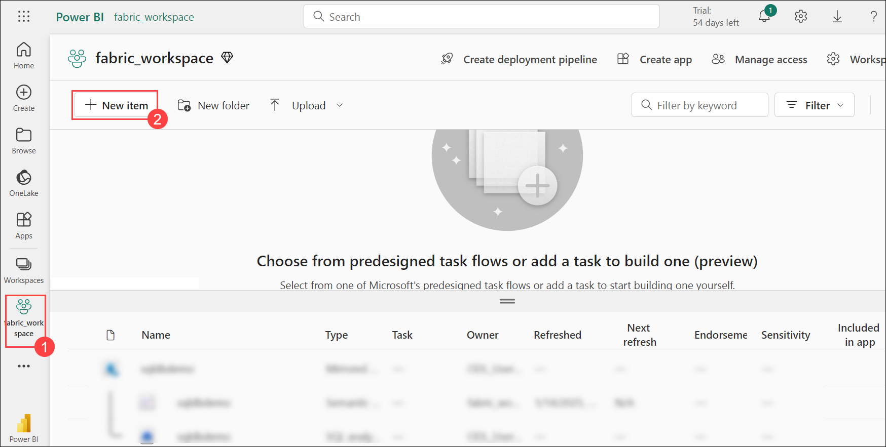
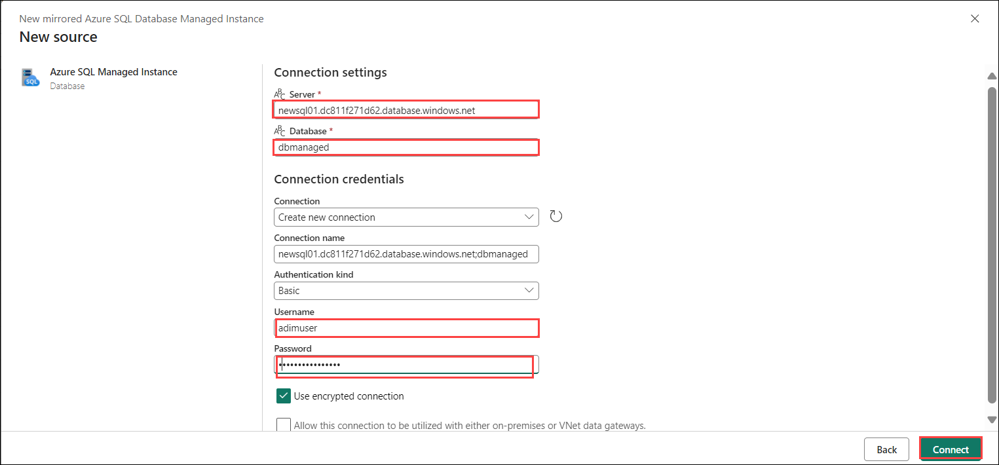

# Lab-03 Configure Microsoft Fabric mirrored databases from Azure SQL Managed Instance (Preview)

In this lab, you will set up two Azure SQL Managed Instances (SQLMI) as primary and secondary and configure SAMI (SQL Server Always On Managed Instance) for mirroring. You will create a mirrored database on the primary instance, enable synchronization with the secondary, and start the mirroring process. Finally, you will monitor the mirroring status using Azure tools to ensure high availability.

### Task-01 :Enable System Assigned Managed Identity (SAMI) of Your Azure SQL Managed Instance


 1. Navigate to Azure portal and search for **SQL Managed Instance (1)** and select **SQL Managed Instance (2)**.

     

1. Select **sqlmi-<inject key="DeploymentID" enableCopy="false"/>**

 1. Navigate to **Identity** under the **Security** section in the resource menu. Then, under **System-assigned managed identity**, set the **Status** to **On** and click on **Save**.

      

1. Click on **Networking (1)** under Security, **Enable (2)** Public endpoint(data) and click on **Save (3)**.

   

1. Connect to your Azure SQL Managed Instance using SQL Server Management Studio (SSMS) and connect to the master database add the below creds :

   - Server name : **<inject key="SqlmI-URL" enableCopy="false"/> (3)**

   - Authentication : **SQL Server Authentication (2)**

   - Login : **<inject key="Sqlmi administrator login" enableCopy="false"/> (3)**

   - Password : **<inject key="Sqlmi administrator password" enableCopy="false"/> (4)**
       

1. Ensure that SAMI is the primary identity. Verify this by running the following T-SQL query.

     ```sql
     SELECT * FROM sys.dm_server_managed_identities;
     ```

1. Create a SQL Authenticated login named fabric_login. You can choose any name for this login. Provide your own strong password. Run the following T-SQL script in the master database by right clicking and selecting the new query

    - Provide the "strong password" as desired

  
     ```
     CREATE LOGIN fabric_login WITH PASSWORD = '<strong password>';
     ALTER SERVER ROLE [##MS_ServerStateReader##] ADD MEMBER fabric_login;
     ```

   

1. You will be able to see a fabric_login that's been created under logins 

    

1. Switch Query Scope to the Database You Want to Mirror

   - Substitute `<mirroring_source_database>` with the name of your database and run the following T-SQL:

     ```sql
     USE [<mirroring_source_database>];
     ```

1. Connect to the Azure SQL Database your plan to mirror to Microsoft Fabric, using the Azure portal query editor, SQL Server Management Studio (SSMS), Create a database user connected to the login: 

     ```
     CREATE USER fabric_user FOR LOGIN fabric_login;
     ```

## Task 02: Create a Mirrored Azure SQL Managed Instance Database

1. Navigate to the **Fabric portal** home.

    

2. Open an existing workspace **fabric-<inject key="DeploymentID" enableCopy="false"/>**

3. In the navigation menu, select **+ New Item**.

   

5. Select **Mirrored Azure SQL Managed Instance (Preview)**.

    

6. Connect to the Azure SQL Managed Instance

7. Under **New sources**, select **Azure SQL Managed Instance**, or select an existing Azure SQL Managed Instance connection from the OneLake catalog.

   >**Note**: You can't use existing connections of type "SQL Server". Only connections of type "SQL Managed Instance" are supported for mirroring Azure SQL Managed Instance data.


9. Select **New connection**, enter the following details:

     - **Server**: Find the Server name by navigating to the **Azure SQL Managed Instance** Networking page in the Azure portal under **Security**.

     - Example: `<managed_instance_name>.public.<dns_zone>.database.windows.net,3342`

         

     - **Database**: **SampleDatabase**

     - **Connection**: Create a new connection.

     - **Connection name**: An automatic name is provided, but you can change it for easier identification
        .
     - **Authentication kind**: Basic (SQL Authentication)

     - **Username** : **<inject key="Sqlmi administrator login" enableCopy="false"/>**

     - **Password** : **<inject key="Sqlmi administrator password" enableCopy="false"/>**
       
     - Select **Connect**.

       

## Task -04: Start the Mirroring Process and Monitor Fabric Mirroring

1. The **Monitor Replication** screen will allow you to mirror all data in the database by default.

    >**Note**:After 2-5 minutes, select **Monitor replication** to see the replication status.

    

1. The status should change to **Running**, which means the tables are being synchronized.

    >**Note**: If you don't see the tables and corresponding replication status, wait a few seconds and refresh the pane.

1. When the initial copying of the tables is finished, a date will appear in the **Last refresh** column.

    - **Important**: Any granular security settings in the source database must be re-configured in the mirrored database in Microsoft Fabric.

1. Once mirroring is configured, you'll be directed to the **Mirroring Status** page, where you can monitor the current state of replication.

1. Replicating Status:
   
      - **Running** – Replication is currently running, bringing snapshot and change data into OneLake.
      - **Running with warning** – Replication is running with transient errors.
      - **Stopping/Stopped** – Replication is stopped.
      - **Error** – Fatal error in replication that can't be recovered.


 1. Table Level Monitoring:

      - **Running** – Data from the table is successfully being replicated into the warehouse.
      - **Running with warning** – Warning of non-fatal error with replication of the data from the table.
      - **Stopping/Stopped** – Replication has stopped.
      - **Error** – Fatal error in replication for that table.


## Review

In this lab, you have set up two Azure SQL Managed Instances (SQLMI) as primary and secondary and configured SAMI (SQL Server Always On Managed Instance) for mirroring. You have created a mirrored database on the primary instance, enabled synchronization with the secondary, and started the mirroring process. Finally, you have monitored the mirroring status using Azure tools to ensure high availability.
