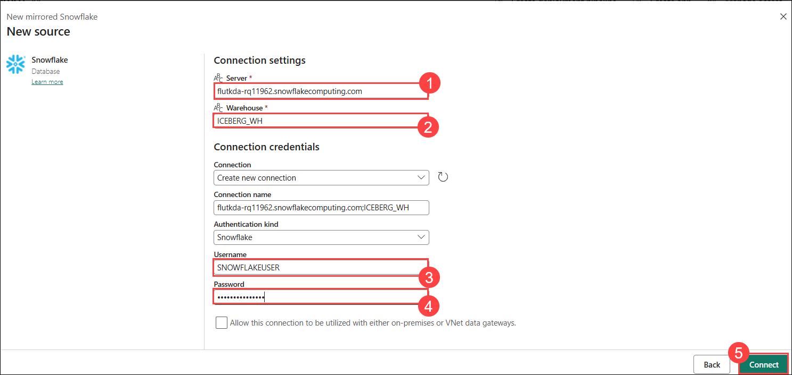
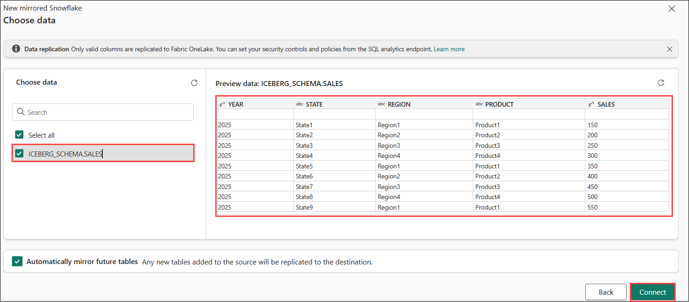
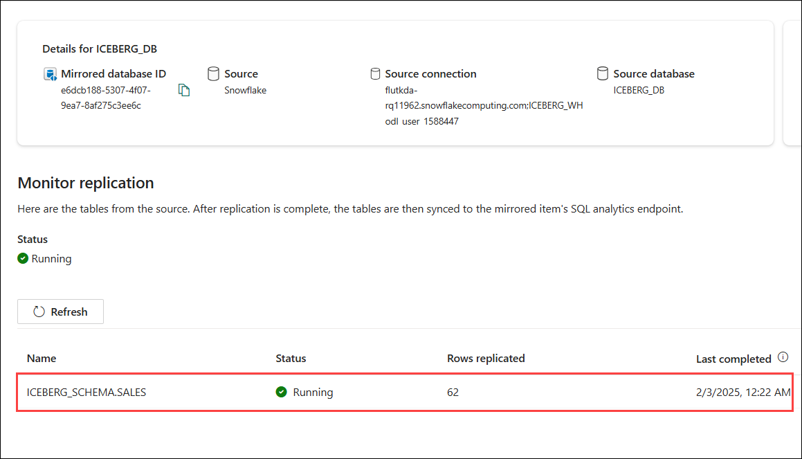
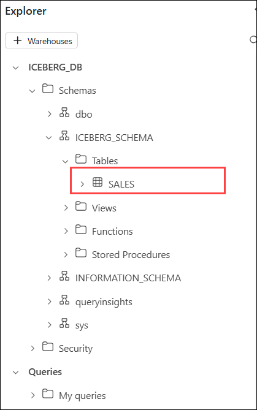
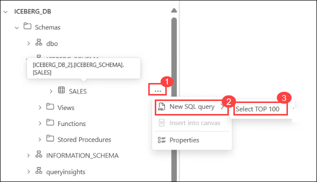

# Lab 04: Mirroring Snowflake in Microsoft Fabric

In this lab, you’ll create a mirrored database in Microsoft Fabric and connect to your Snowflake instance on any cloud platform. You’ll start the mirroring process to replicate the Snowflake database into Fabric. Finally, you’ll monitor and view the status of the Fabric Snowflake mirroring process to ensure successful replication and synchronization.

## Task 01: Create a mirrored database in Microsoft Fabric 

In this section, we'll provide a brief overview of how to create a new mirrored database to use with your mirrored Snowflake data source.

1. Navigate to the **Fabric portal** home.

    

2. Open an existing workspace **fabric-<inject key="DeploymentID" enableCopy="false"/>**

3. In the navigation menu, select **+ New Item**.

   

## Task 02: Connect to your Snowflake instance in any cloud 

1. Select **Mirrored Snowflake** under get data.

   

1. Select **Snowflake** under **Choose a database connection**. 

    

2. **Configure Connection Settings**
   on the **New connection**, enter the following connection details and click on **Connect (6)**

   | Connection Setting | Description |
   |------------------------|-----------------|
   | **Server (1)**| flutkda-rq11962.snowflakecomputing.com|
   | **Warehouse (2)**| ICEBERG_WH |
   | **Connection**| Create new connection |
   | **Connection name** | SNOWFLAKE |
   | **Authentication kind (3)** | Snowflake |
   | **Username (4)**| SNOWFLAKEUSER |
   | **Password (5)**| Adminuser@12345 |
  

      

  1. **Select all** , then **click** on the table. You will be able to **see the preview** in the right pane. After that, **click on Connect**.
     
     

1. In the **New connection** pane, select **ICEBERG_DB (1)** from the drop-down, then **click on Connect (2)**.

    

1. Select **ICEBERG_DB (1)** database from dropdown list and click on **Connect mirrored database (2)**.

      
      
## Task 03: Initiate the mirroring process for the Snowflake database, and monitor and view the Snowflake Fabric mirroring.

1. The **Creation of mirrored database** begins.

    

1. After configuring mirroring, you'll be redirected to the Mirroring Status page, where you can monitor the replication status.

   > **Note:** Allow 2-5 minutes, then click Monitor replication to check the status.

1. Within a few minutes, the status will update to **Running**, indicating that the tables are being synchronized. Once the initial table copying is complete, a date will appear in the **Last Refresh** column.

      

>**Note**: If the tables and replication status are not immediately visible, wait a few seconds and refresh the panel.

## Task 04: Query and view the mirrored data

1. Open **Query in T-SQL** by selecting it from the **Monitor Replication** window.

    

1. In the **Explorer** pane, expand **Iceberg_schema** > **Tables**, and you will see the **Sales** table.

     

1. From the ellipses on the **Sales (1)** table, **click** on it, **select New SQL Query(2)**, and choose **Show Top 100 (3)**.

     

1. Now, the query will run automatically.

     

1. From the **Results**, you can view all the **Top 100** rows.

     

   ## Review
   
   In this lab, you have completed creating a mirrored database in Microsoft Fabric and connected it to your Snowflake instance. You successfully initiated the mirroring process to replicate the Snowflake database into Fabric. Additionally, you monitored and reviewed the status of the Fabric Snowflake mirroring process. This ensured that the database replication and synchronization were performed correctly.
