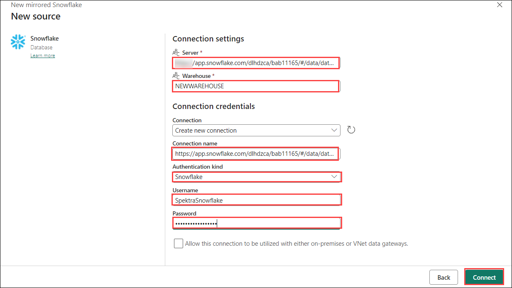
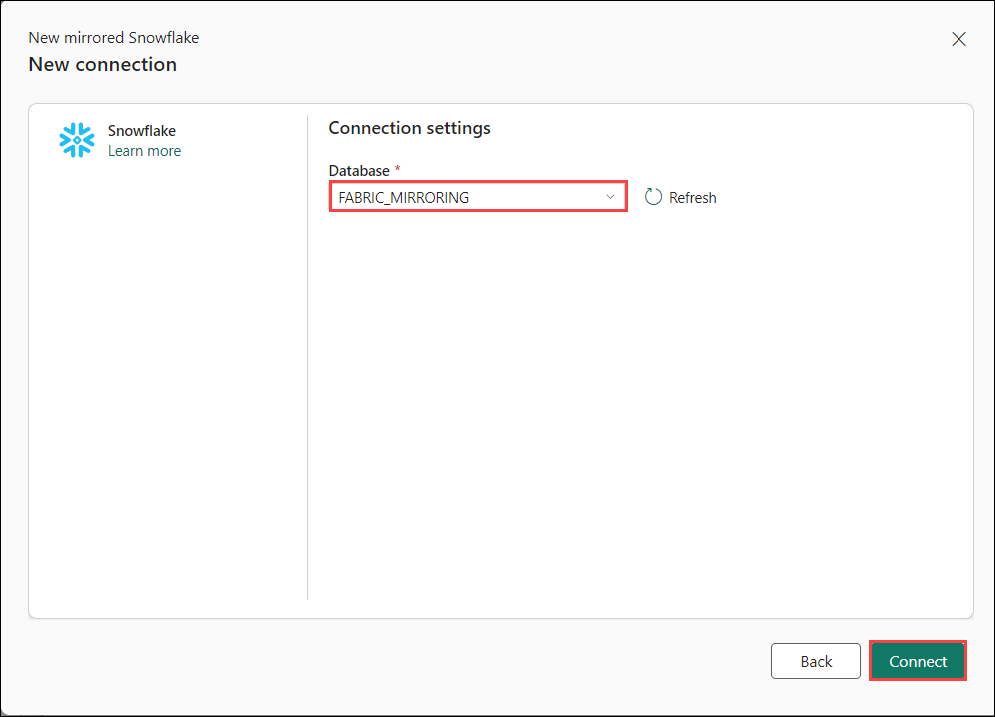
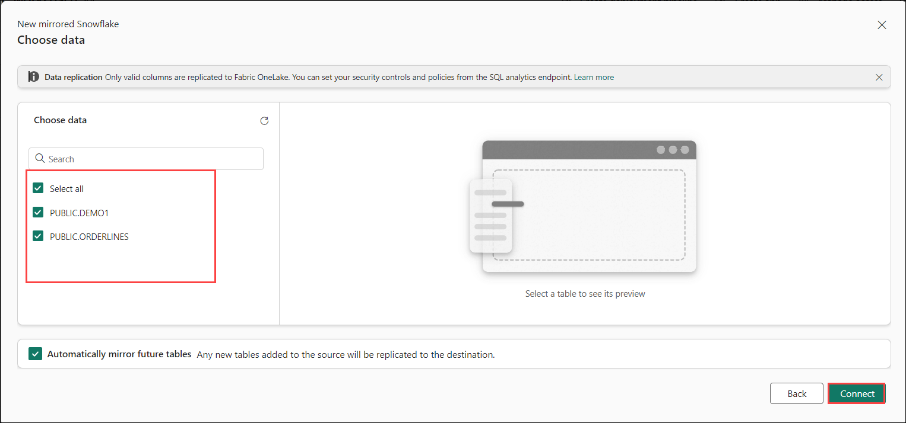
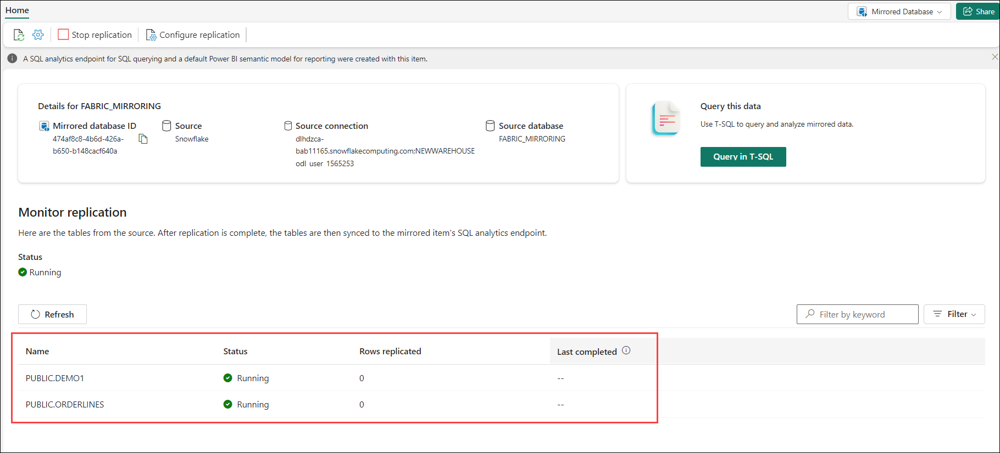

# Lab-04 Mirroring Snowflake in Microsoft Fabric

In this lab, you’ll create a mirrored database in Microsoft Fabric and connect to your Snowflake instance on any cloud platform. You’ll start the mirroring process to replicate the Snowflake database into Fabric. Finally, you’ll monitor and view the status of the Fabric Snowflake mirroring process to ensure successful replication and synchronization.

## Task-01: Create a mirrored database in Microsoft Fabric 

In this section, we'll provide a brief overview of how to create a new mirrored database to use with your mirrored Snowflake data source.

1. Navigate to the **Fabric portal** home.

    

2. Open an existing workspace **fabric-<inject key="DeploymentID" enableCopy="false"/>**

3. In the navigation menu, select **+New Item**.

   

4. **Scroll down** and select the **Mirrored Snowflake** card.

     

1. Enter a name as **Mirrored_<inject key="DeploymentID" enableCopy="false"/>** and Click on create **Create**

     

## Task-02 Connect to your Snowflake instance in any cloud 

1. Select **Snowflake** under **New connection** . 

2. **Configure Connection Settings**
   If you selected **New connection**, enter the following connection details:

   | Connection Setting | Description |
   |------------------------|-----------------|
   | **Server**             | dlhdzca-bab11165snowflakecomputing.com|
   | **Warehouse**          | NEWWAREHOUSE |
   | **Connection**         | Create new connection |
   | **Connection name**    | Default |
   | **Authentication kind** | Snowflake |
   | **Username**           | |
   | **Password**           | |
   | **Database**           | FABRIC_MIRRORING|

      

1. Select **FABRIC_MIRRORING** database from dropdown list.

      

1. View the tablets that's selected and then click on **Create**.

      
   
1. The **Configure mirroring** screen will allow you to mirror all data in the database by default.
     
     
      
## Task-03 Start mirroring process for Snowflake database 

1. Click **Mirror database**. The mirroring process will begin.

1. Once mirroring is configured, you're directed to the Mirroring Status page. Here, you can monitor the current state of replication.

   >**Note**: Wait for 2-5 minutes. Then, select Monitor replication to see the status.

1. After a few minutes, the status should change to Running, which means the tables are being synchronized.

1. If you don't see the tables and the corresponding replication status, wait a few seconds and then refresh the panel.

1. When they have finished the initial copying of the tables, a date appears in the Last refresh column.

## Task-04 Monitor & View of the Fabric Snowflake Mirroring 

1. Observe the replication process and view the active Fabric operations.

   

1. Table Level Monitoring:

      - **Running** – Data from the table is successfully being replicated into the warehouse.
      - **Running with warning** – Warning of non-fatal error with replication of the data from the table.
      - **Stopping/Stopped** – Replication has stopped.
      - **Error** – Fatal error in replication for that table.

   ## Review
   
   In this lab, you have completed creating a mirrored database in Microsoft Fabric and connected it to your Snowflake instance. You successfully initiated the mirroring process to replicate the Snowflake database into Fabric. Additionally, you monitored and reviewed the status of the Fabric Snowflake mirroring process. This ensured that the database replication and synchronization were performed correctly.