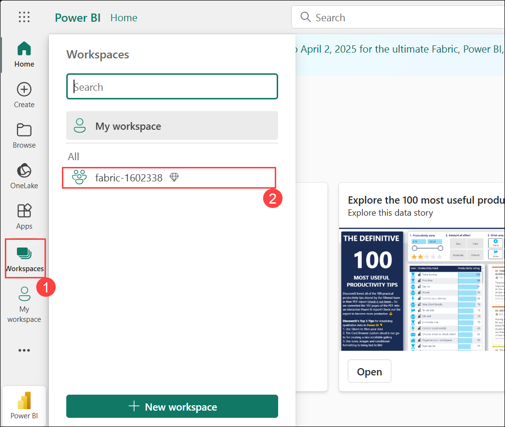
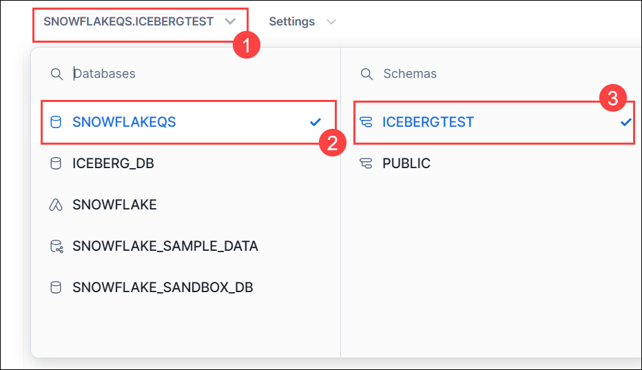

# Lab 04: Mirroring Snowflake in Microsoft Fabric

## Lab Scenario

In this lab, you will configure database mirroring for Snowflake within Microsoft Fabric. Your goal is to set up seamless data synchronization between Snowflake and Microsoft Fabric, ensuring high availability, disaster recovery, and low-latency data access across regions. By the end of this lab, you will have successfully mirrored your Snowflake database in Microsoft Fabric, enabling real-time replication and enhanced availability for your data-driven applications.

## Lab objectives
In this lab, you will complete the following tasks:

- Task 01: Create a mirrored database in Microsoft Fabric 
- Task 02: Connect to your Snowflake instance in any cloud 
- Task 03: Initiate the mirroring process for the Snowflake database, and monitor and view the Snowflake Fabric mirroring.
- Task 04: Query and view the mirrored data
- Task 05: Getting started with iceberg in lakehouse

## Estimated time: 65 minutes


## Task 01: Create a mirrored database in Microsoft Fabric 

In this task, you will create a mirrored database in Microsoft Fabric to enable high availability and real-time data synchronization across environments.

1. Go to the **Fabric portal** homepage at `https://app.fabric.microsoft.com/` and select **Power BI** from the bottom left pane.

   

2. In the left-hand pane, click on **workspace (1)** and choose the existing workspace named **fabric-<inject key="DeploymentID" enableCopy="false"/>(2)**.

   

3. Select **+ New Item**.

   


## Task 02: Connect to your Snowflake instance in any cloud 

In this task, you will connect to your Snowflake instance hosted in any cloud to enable data integration and management.

You will be Mirroring the pre-created iceberg table in the database.

1. In filter by item type, search for **Mirrored Snowflake**.

   


2. Select **Snowflake** under **Choose a database connection to get started**. 


   

3. **Configure Connection Settings**
   on the **New connection**, enter the following connection details, and click on **Connect (6)**

   | Connection Setting | Description |
   |------------------------|-----------------|
   | **Server (1)**| jcxsfvs-tv61584.snowflakecomputing.com|
   | **Warehouse (2)**| ICEBERG_WH |
   | **Connection**| Create new connection |
   | **Connection name (3)** | SNOWFLAKE |
   | **Authentication kind (4)** | Snowflake |
   | **Username (5)**| SNOWFLAKEUSER |
   | **Password (6)**| Adminuser@12345 |

   Click on **Connect (7)**.

   
 
    >**Note**: Ensure you remove any spaces when copying the credentials, make sure the spaces are removed from the password, and then paste them.Otherwise, it may result in invalid credentials.


4. In the **New connection** pane, select **ICEBERG_DB (1)** from the drop-down, then click on **Connect (2)**.

   

5. **Select all** from the choose data pane, After that, click on **Connect**.

     
   


6. Leave the name as **ICEBERG_DB (1)** and click on **Connect mirrored database (2)**.

   
      
## Task 03: Initiate the mirroring process for the Snowflake database, and monitor and view the Snowflake Fabric mirroring.

In this task, you will initiate the mirroring process for the Snowflake database, and monitor the synchronization and status of Snowflake Fabric mirroring to ensure data consistency and availability.

1. In the previous task, you clicked on **"Create Mirrored Database,"** and now the process of creating the mirrored database will begin.

   

2. After configuring mirroring, you'll be redirected to the Mirroring Status page, where you can monitor the replication status.

   > **Note:** Allow 2-5 minutes, then click Monitor replication to check the status.


3. Within a few minutes, the status will update to **Running**, indicating that the tables are being synchronized. Once the initial table copying is complete, a date will appear in the **Last completed** column.

   

>**Note**: If the tables and replication status are not immediately visible, wait a few seconds and refresh the panel.

>**Note**: **If the tables are not replicated after 5-10 minutes, please go ahead and recreate the connection. This could be due to a backend issue where the API hasn't accepted the request or the process is still in a queued state. Perform from Task 2 again to build the new connection.**


## Task 04: Query and view the mirrored data

In this task, you will query and view the mirrored data to verify successful synchronization and consistency between the source and mirrored databases.

1. Open **Query in T-SQL** by selecting it from the **Monitor Replication** window.

   


2. In the **Explorer** pane, expand **Iceberg_schema** > **Tables**, and you will see the **Salesdemo** table.

   


3. Click on the ellipses on the **Salesdemo (1)** table, Select **New SQL Query (2)**, and choose **Select Top 100 (3)**.

   

4. Now, the query will run automatically.

   

5. From the **Results**, you can view all the **Top 100** rows.

   

## Task 05 : Getting started with iceberg in lakehouse 

In this task, you will get started with Apache Iceberg in a Lakehouse environment to manage large-scale data with optimized storage and querying capabilities.

1. In the **Search resources, services, and docs** bar in Azure, type **Microsoft Fabric (1)** and select **Microsoft Fabric (2)** from the results.

   


2. From **Microsoft Fabric** resource page, click on **+ Create**.

   

3. Fill the following details as provided below:

   - Resource Group : Choose from the drop-down and select **Fabric-<inject key="DeploymentID" enableCopy="false"/>** (1)

   - Capacity name: **snowflakefabric<inject key="DeploymentID" enableCopy="false"/>**** 
    (2)

   - Region : **WEST US 2** (3)

   - Size : Click on **change size** and select **F2** from the list provided. (4)

   - Fabric capacity administartor : **<inject key="AzureAdUserEmail"></inject>** (5)

   - Click on **Review + Create** (6)

      

4. Now, Click on **Create** .

   

5. Navigate back to **Fabric portal** home page and select **Power bi** from bottom pane.

   

6. Click on **My Workspace (1)** from the left pane and select **+New Workspace (2)**.


   

7. Create a new workspace and name it **snowflakefabric-<inject key="DeploymentID" enableCopy="false"/> (1)** and Expand **Advanced (2)**.

   


8. On the create new workspace page, Choose the **fabric capacity (1)** under License mode, select **snowflakefabric-WESTUS2 (2)** from the drop-down, and click **Apply (3)**.

   

9. Now the page will be redirected to new workspace that is been created, choose **+New item** from that workspace.
   
   

10. Search for **Lakehouse** in **Filter for item type** bar and select it.

11. Select Lakehouse, name it **snowflakeQS** and click on **Create**.

    

12. In the Explorer, click the **ellipse** next to Files, then choose **Properties**.

    


13. In the Properties Menu, Copy the **URL** and paste it in notepad as it will used in further steps.


    


14. You will need your Azure Tenant ID. To find this in Fabric UI:

      - In the upper right click on the ? for **help & support(1)** and at the bottom click **About Power BI (2)**

        

      - Select and Copy the Tenant URL. The Tenant ID is the UUID that follows ctid= and paste in the notepad.

         

         > NOTE: Make sure to copy only Tenant URL as highlighted below.

         

 15. Sign in to Snowflake by opening the browser, pasting the URL, and entering the username and password provided below:

     - **URL (1)** : `https://jcxsfvs-tv61584.snowflakecomputing.com`

     - **USERNAME (2)** : `SNOWFLAKEUSER`

     - **PASSWORD (3)**: `Adminuser@12345`

     - Click on **Sign in (4)**. 

         


 16. In the Snowflake home page, in the top right corner, click on **+ Create** and a drop-down menu will appear, then select **SQL Worksheet**.


     

 17. You can see the database already created in the left-hand pane that is **SNOWFLAKEQS**. You will be using this same database and schema to complete the upcoming tasks.
 
     


 18. Go to **workspace sheet (1)**, select **SNOWFLAKEQS (2)** as the **database** and **ICEBERGTESTS (3)** as the **schema**.

     


 19. In the workspace, at the top right corner, choose **Account admin** and select warehouse as **HOL-WH**.

     

20. Copy this query into Snowflake and fill in the parameters with the collected information.

      - Replace `FabricWorkspaceName` with snowflakefabric-<inject key="DeploymentID" enableCopy="false"/>.

      - Replace `FabricLakehouseName` with **snowflakeQS**.
      
      - Replace `Tenant_ID` with the copied ID from Step 12.

         ```
         CREATE OR REPLACE EXTERNAL VOLUME FabricExVoldemo<inject key="DeploymentID" enableCopy="false"/>
         STORAGE_LOCATIONS =
            (
            (
               NAME = 'FabricExVoldemo<inject key="DeploymentID" enableCopy="false"/>'
               STORAGE_PROVIDER = 'AZURE'
               STORAGE_BASE_URL = 'azure://onelake.dfs.fabric.microsoft.com/<FabricWorkspaceName>>/<FabricLakehouseName>.Lakehouse/Files/'
               AZURE_TENANT_ID = '<Tenant ID>'
            )
            );   
         ```
      
21. Once all the parameters are filled in, the code should resemble the screenshot provided below. This is for reference only.

    

22. Select the **code (1)** and click **Run (2)**.

    

      >**Note**: The Deployment ID is unique to each individual, making it a good practice to create different external locations.


23. Copy and paste the below code, select it and click on run.

      ```
      DESC EXTERNAL VOLUME FabricExVoldemo<inject key="DeploymentID" enableCopy="false"/>;
      ```
      

24. In the output section, click on the **property value(1)** to open a larger view. From there, you can expand it and **copy it to a notepad(2)**.


      

25. Then copy the URL highlighted in the screenshot.

    

26. The copied URL should appear as shown below; this is for reference only.

      `https://login.microsoftonline.com/25406093-1a74-42f7-9c55-70329f4f2934/oauth2/authorize?client_id=de3c7a34-4c5c-4a6e-a44c-8ee2c88d5bee&response_type=code`

27. Open the browser, paste the URL, and in the **"Pick an account"** pane, select Username: <inject key="AzureAdUserEmail"></inject>.

28. A pop-up will appear asking for your confirmation. Copy the **APP name(1)** and paste it in notepad, then Click on **Accept (2)**.


      

29. In Fabric, provide the service principal with access to the **snowflakeQS** Fabric lakehouse.

30. Select **Workspaces (1)** from the left-hand pane, then choose the workspace **snowflakefabric-<inject key="DeploymentID" enableCopy="false"/>(2)**.

      

31. Click on **Manage access (1)**.

      

32. Next, click on **+ Add people or groups under** Manage access.

    


33. Paste the copied **App name (1)**, select **admin (2)** from the **drop-down**, and then click **Add (3)**.

    


34. Return to the Snowflake session opened in browser and run the following to create the Iceberg table and insert data from the sample dataset.

      ```
      --Create the Iceberg table in OneLake
      CREATE OR REPLACE ICEBERG TABLE snowflakeQS.ICEBERGTEST.dim_customer (
            C_CUSTKEY STRING,
            C_NAME STRING,
            C_ADDRESS STRING,
            C_NATIONKEY STRING,
            C_PHONE STRING,
            C_ACCTBAL STRING,
            C_MKTSEGMENT STRING,
            C_COMMENT STRING
         )
         EXTERNAL_VOLUME = 'FabricExVoldemo<inject key="DeploymentID" enableCopy="false"/>'
         CATALOG = snowflake
         BASE_LOCATION = 'dim_customer';

      --Insert sample data
      INSERT INTO SnowflakeQS.ICEBERGTEST.dim_customer
         SELECT top 500 * FROM SNOWFLAKE_SAMPLE_DATA.TPCH_SF1.customer;

      --Query the Iceberg table from Snowflake
      Select * from SnowflakeQS.ICEBERGTEST.dim_customer
      ```

34. Paste the code, **select it (1)**, and then click **Run (2)**.

   
    

    >**Note** : If you encounter any issues while running the code, execute each block individually and check the outputs.

35. After running the code, you will be able to view the results, as shown in the screenshot below.

    

36. In order for Fabric to work on the Iceberg tables, you need to set up shortcuts to the data.

      - Find the location of your Iceberg table in storage. The Iceberg table folder contains a ‘metadata' folder.

         ```
         SELECT SYSTEM$GET_ICEBERG_TABLE_INFORMATION('dim_customer');
         
         ```

         

37. This will return a path to the metadata file for this table, which should show you which storage account contains the Iceberg table. 

   - **For example, this is the relevant info to find the table:**

      ```

      {"metadataLocation":"azure://onelake.blob.fabric.microsoft.com/snowflakefabric-1602338/snowflakeQS.Lakehouse/Files/dim_customer/metadata/00001-51ebd3eb-de39-43b4-8e3b-d7fde4ec7de1.metadata.json","status":"success"}

      ```

38. Navigate back to Fabric and open the **snowflakefabric-<inject key="DeploymentID" enableCopy="false"/>** workspace, which contains the **snowflakeQS** Fabric lakehouse object.

39. Click Workspace settings.

    

40. Under Delegated settings, click OneLake settings, and turn on the Authenticate with OneLake user-delegated SAS tokens setting. 

    

41. In **snowflakefabric-<inject key="DeploymentID" enableCopy="false"/>** workspace, open your Fabric lakehouse **snowflakeQS** .

42. Click the **ellipsis (1)** next to **Files** and then select **New shortcut (2)** from **Files**.

    

43. Select a **OneLake** Shortcut.

    

44. Select **snowflakeQS (1)** lakehouse and then click **Next (2)**.

    

45. Expand **Files(1)**, select **dim_customer(2)**, and click **Next(3)**.

    

46. In the "New Shortcut" window, click **Create**.

    

47. You can see the newly created shortcut.

    

 
## Summary:

In this lab, you have accomplished the following:

- **Created a mirrored database** in **Microsoft Fabric** for data synchronization and high availability.
- **Connected to your Snowflake instance** in any cloud to enable data integration.
- **Initiated the mirroring process** for the Snowflake database, and monitored **Snowflake Fabric mirroring** to ensure real-time synchronization.
- **Queried and viewed the mirrored data** to verify successful replication and consistency.
- **Gotten started with Apache Iceberg** in the Lakehouse environment to optimize data storage and querying.

### Congratulations! You have successfully finished the lab. Click Next >> to Proceed to the next lab.
