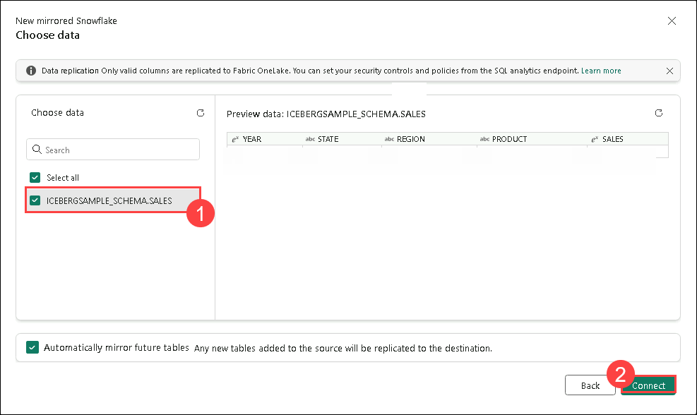
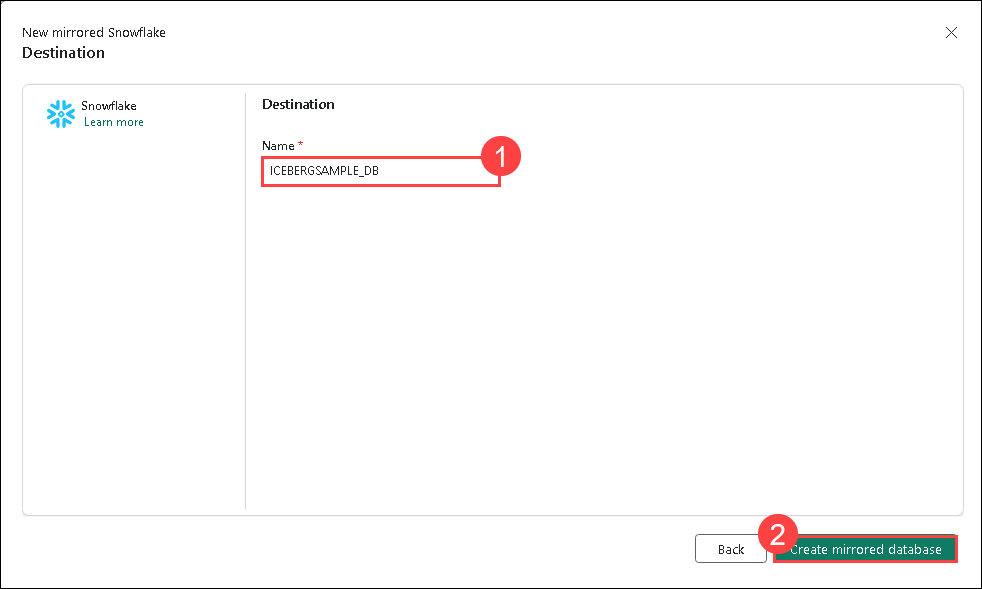

# Lab 04: Mirroring Snowflake in Microsoft Fabric

In this lab, you’ll create a mirrored database in Microsoft Fabric and connect to your Snowflake instance on any cloud platform. You’ll start the mirroring process to replicate the Snowflake database into Fabric. Finally, you’ll monitor and view the status of the Fabric Snowflake mirroring process to ensure successful replication and synchronization.

## Task 01: Create a mirrored database in Microsoft Fabric 

In this section, we'll provide a brief overview of how to create a new mirrored database to use with your mirrored Snowflake data source.

1. Navigate to the **Fabric portal** home.

    

2. Open an existing workspace **fabric-<inject key="DeploymentID" enableCopy="false"/>**

3. In the navigation menu, select **+ New Item**.

   

## Task 02 Connect to your Snowflake instance in any cloud 

1. Navigate back to your workspaace and create a new item.

1. Select **Mirrored Snowflake** under get data.

   

1. Select **Snowflake** under **Choose a database connection**. 

2. **Configure Connection Settings**
   If you selected **New connection**, enter the following connection details and click on **Connect (6)**

   | Connection Setting | Description |
   |------------------------|-----------------|
   | **Server (1)**| lg70717.west-us-2.azure.snowflakecomputing.com|
   | **Warehouse (2)**| ICEBERGSAMPLE_WH |
   | **Connection**| Create new connection |
   | **Connection name** | Default |
   | **Authentication kind (3)** | Snowflake |
   | **Username (4)**| ICEBERGUSER |
   | **Password (5)**| Adminuser@12345|
   | **Database**| |

      

  1. View the tablets that's selected and then click on **Connect**.
     
     

1. Select **ICEBERGSAMPLE_DB** database from dropdown list and click on **Connect mirrored database**.

      
      
## Task 03 Start mirroring process for Snowflake database 

1. Click Mirror database to start the mirroring process.

1. After configuring mirroring, you'll be redirected to the Mirroring Status page, where you can monitor the replication status.

   > **Note:** Allow 2-5 minutes, then click Monitor replication to check the status.

1. Within a few minutes, the status should update to Running, indicating that the tables are being synchronized.

1. If the tables and replication status are not immediately visible, wait a few seconds and refresh the panel.

1. Once the initial table copying is complete, a date will appear in the Last refresh column.

## Task 4 : Monitor & View of the Fabric Snowflake Mirroring 

1. Observe the replication process and view the active Fabric operations.

   

1. Table Level Monitoring:

      - **Running** – Data from the table is successfully being replicated into the warehouse.
      - **Running with warning** – Warning of non-fatal error with replication of the data from the table.
      - **Stopping/Stopped** – Replication has stopped.
      - **Error** – Fatal error in replication for that table.

   ## Review
   
   In this lab, you have completed creating a mirrored database in Microsoft Fabric and connected it to your Snowflake instance. You successfully initiated the mirroring process to replicate the Snowflake database into Fabric. Additionally, you monitored and reviewed the status of the Fabric Snowflake mirroring process. This ensured that the database replication and synchronization were performed correctly.
