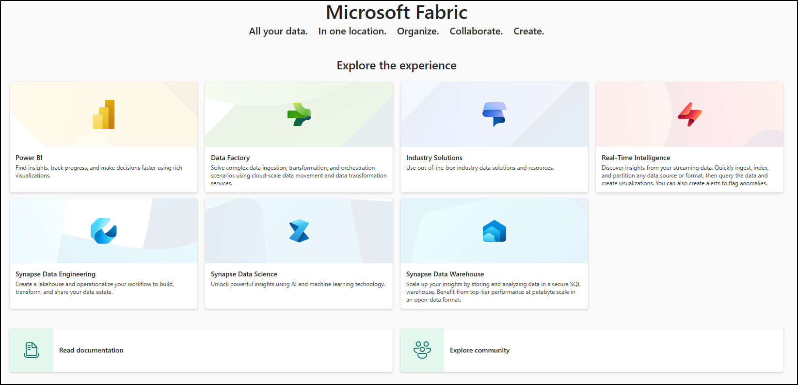

# Lab-04 Mirroring Snowflake in Microsoft Fabric

In this section, we'll provide a brief overview of how to create a new mirrored database to use with your mirrored Snowflake data source.

1. Navigate to the **Fabric portal** home.

    

2. Open an existing workspace **fabric-<inject key="DeploymentID" enableCopy="false"/>**

3. In the navigation menu, select **+New Item**.

   

4. **Scroll down** and select the **Mirrored Snowflake** card.

     

1. Enter a name as **Mirrored_<inject key="DeploymentID" enableCopy="false"/>** and Click on create **Create**

     

# Connect to Your Snowflake Instance in Any Cloud

1. Select **Snowflake** under **New connection** . 

2. **Configure Connection Settings**
   If you selected **New connection**, enter the following connection details:

   | Connection Setting | Description |
   |------------------------|-----------------|
   | **Server**             | dlhdzca-bab11165snowflakecomputing.com|
   | **Warehouse**          |  |
   | **Connection**         |  |
   | **Connection name**    | |
   | **Authentication kind** | Snowflake |
   | **Username**           | |
   | **Password**           | |
   | **Database**           |  |

5. Start the Mirroring Process
   
1. The **Configure mirroring** screen will allow you to mirror all data in the database by default.

2. Mirror all data** means that any new tables created after mirroring is started will be mirrored.

3. Optionally, you can disable the **Mirror all data** option and choose only certain objects to mirror by selecting individual tables from your database.

4. For this tutorial, we select the **Mirror all data** option.

5. Begin Mirroring

6. Click **Mirror database**. The mirroring process will begin.

