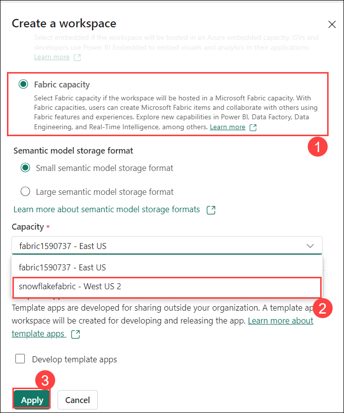
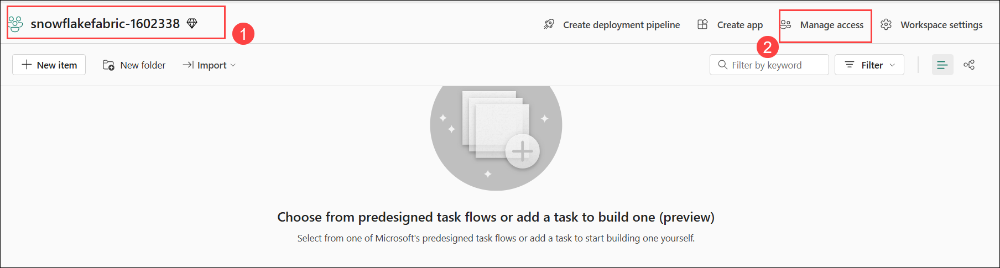
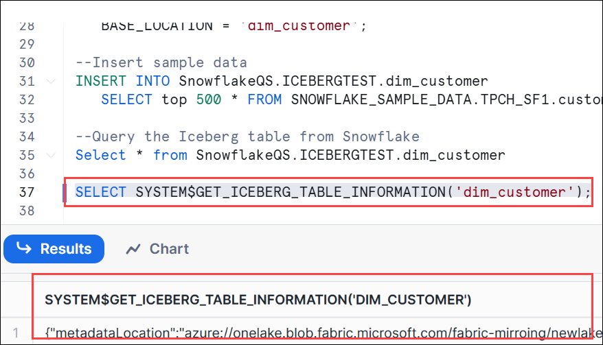
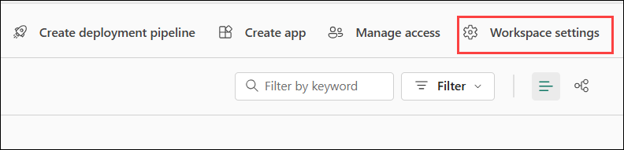

# Lab 04: Mirroring Snowflake in Microsoft Fabric

## Lab Scenario

In this lab, you will configure database mirroring for Snowflake within Microsoft Fabric. Your goal is to set up seamless data synchronization between Snowflake and Microsoft Fabric, ensuring high availability, disaster recovery, and low-latency data access across regions. By the end of this lab, you will have successfully mirrored your Snowflake database in Microsoft Fabric, enabling real-time replication and enhanced availability for your data-driven applications.

## Lab objectives
In this lab, you will complete the following tasks:

- Task 01: Create a mirrored database in Microsoft Fabric 
- Task 02: Connect to your Snowflake instance in any cloud 
- Task 03: Initiate the mirroring process for the Snowflake database, and monitor and view the Snowflake Fabric mirroring.
- Task 04: Query and view the mirrored data
- Task 05: Getting started with iceberg in lakehouse

## Estimated time: 75 minutes


## Task 01: Create a mirrored database in Microsoft Fabric 

In this task, you will create a mirrored database in Microsoft Fabric to enable high availability and real-time data synchronization across environments.

1. Navigate to the **Fabric portal** home.

    

2. Open an existing workspace **fabric-<inject key="DeploymentID" enableCopy="false"/>**

3. In the navigation menu, select **+ New Item**.

   


## Task 02: Connect to your Snowflake instance in any cloud 

In this task, you will connect to your Snowflake instance hosted in any cloud to enable data integration and management.

You will be Mirroring the pre-created iceberg table in the database.

1. Select **Mirrored Snowflake** under get data.

   

1. Select **Snowflake** under **Choose a database connection**. 

    

2. **Configure Connection Settings**
   on the **New connection**, enter the following connection details, and click on **Connect (6)**

   | Connection Setting | Description |
   |------------------------|-----------------|
   | **Server (1)**| flutkda-rq11962.snowflakecomputing.com|
   | **Warehouse (2)**| ICEBERG_WH |
   | **Connection**| Create new connection |
   | **Connection name** | SNOWFLAKE |
   | **Authentication kind (3)** | Snowflake |
   | **Username (4)**| SNOWFLAKEUSER |
   | **Password (5)**| Adminuser@12345 |
  

      

  
1. In the **New connection** pane, select **ICEBERG_DB (1)** from the drop-down, then **click on Connect (2)**.

    

  1. **Select all** from the choose data pane, then **click** on the table. You will be able to **see the preview** in the right pane. After that, **click on Connect**.
     
     


1. Select **ICEBERG_DB (1)** database from the dropdown list and click on **Connect mirrored database (2)**.

      
      
## Task 03: Initiate the mirroring process for the Snowflake database, and monitor and view the Snowflake Fabric mirroring.

In this task, you will initiate the mirroring process for the Snowflake database, and monitor the synchronization and status of Snowflake Fabric mirroring to ensure data consistency and availability.

1. The **Creation of mirrored database** begins.

    

1. After configuring mirroring, you'll be redirected to the Mirroring Status page, where you can monitor the replication status.

   > **Note:** Allow 2-5 minutes, then click Monitor replication to check the status.

1. Within a few minutes, the status will update to **Running**, indicating that the tables are being synchronized. Once the initial table copying is complete, a date will appear in the **Last Refresh** column.

      

>**Note**: If the tables and replication status are not immediately visible, wait a few seconds and refresh the panel.

>**Note**: **If the tables are not replicated after 5-10 minutes, please go ahead and recreate the connection. This could be due to a backend issue where the API hasn't accepted the request or the process is still in a queued state. Perform from Task 2 again to build the new connection.**


## Task 04: Query and view the mirrored data

In this task, you will query and view the mirrored data to verify successful synchronization and consistency between the source and mirrored databases.

1. Open **Query in T-SQL** by selecting it from the **Monitor Replication** window.

    


1. In the **Explorer** pane, expand **Iceberg_schema** > **Tables**, and you will see the **Sales** table.

     

1. Click on the ellipses on the **Sales (1)** table, **select New SQL Query (2)**, and choose **Show Top 100 (3)**.

     

1. Now, the query will run automatically.

     

1. From the **Results**, you can view all the **Top 100** rows.

     

## Task 05 : Getting started with iceberg in lakehouse 

In this task, you will get started with Apache Iceberg in a Lakehouse environment to manage large-scale data with optimized storage and querying capabilities.

1. Search for **Microsoft Fabric** in the Azure portal and select it.

    

1. Click on **+ Create**.

    

1. Fill the following details as below:

   - Resource Group : Choose from the drop-down and select **Fabric-<inject key="DeploymentID" enableCopy="false"/>**(1)

   - Capacity name: **snowflakefabric**(2)

   - Region : **WEST US2** (3)

   - Size : **F2** (4)

   - Fabric capacity administartor : **<inject key="AzureAdUserEmail"></inject>** (5)

   - **Review + Create** (6)

      

1. Now, Click on **Create** .

     

1. On the **Fabric portal** ,Click on **My Workspace (1)** and select **+New Workspace (2)**.

    

1. Create a new workspace and name it **snowflakefabric (1)** and Expand **Advanced (2)**.

   

1. Choose the **fabric capacity (1)**, select **snowflakefabric-WESTUS2 (2)** from the drop-down, and click **Apply (3)**.

    

1. Create a **New Item**.
   
    

1. Select Lakehouse and name it **snowflakeQS**

   

1. In the Explorer, click the elipses next to Files and then Properties.In the Properties Menu, copy the URL.

    

1. In the Explorer, click the elipses next to Files and then Properties.
In the Properties Menu, copy the URL.

     


1. You will need your Azure Tenant ID. To find this in Fabric UI:

   - In the upper right click on the ? for **help & support(1)** and at the bottom click **About Fabric(2)**

      

   - Copy the Tenant URL. The Tenant ID is the UUID that follows ctid= and paste in the notepad.

      

      

 1. Sign in to Snowflake by opening the browser, pasting the URL, and entering the username and password provided below:

     - URL : `https://flutkda-rq11962.snowflakecomputing.com`

     - USERNAME: `SNOWFLAKEUSER`

     - PASSWORD: `Adminuser@12345`

     

 1. Select **SQL Worksheet** from the **+ Create** drop-down menu.

      

 1. You can see the database already created in the left-hand pane that is **SNOWFLAKEQS**. You will be using this same database and schema to complete the upcoming tasks.
 
    

 1. In the workspace sheet, select **SNOWFLAKEQS** as the **database** and **ICEBERGTESTS** as the **schema**.

    

 1. Choose the warehouse as **HOL-WH**

      

  1. Copy this query into Snowflake and fill in the parameters with the collected information.

      ```
      CREATE OR REPLACE EXTERNAL VOLUME FabricExVoldemo<inject key="DeploymentID" enableCopy="false"/>
      STORAGE_LOCATIONS =
         (
         (
            NAME = 'FabricExVoldemo<inject key="DeploymentID" enableCopy="false"/>'
            STORAGE_PROVIDER = 'AZURE'
            STORAGE_BASE_URL = 'azure://onelake.dfs.fabric.microsoft.com/<FabricWorkspaceName>>/<FabricLakehouseName>.Lakehouse/Files/'
            AZURE_TENANT_ID = '<Tenant ID>'
         )
         );   
      ```
      
      

      >**Note**: The Deployment ID is unique to each individual, making it a good practice to create different external locations.

1. Now you need to enable Snowflake permission to access **snowflakefabric** workspace. First run the following in Snowflake:

   ```
   DESC EXTERNAL VOLUME FabricExVoldemo<inject key="DeploymentID" enableCopy="false"/>;
   ```

1. In the output section, click on the **property value(1)** to open a larger view. From there, you can expand it or **copy it to a notepad(2)**.


   

1. Then copy the URL highlighted in the screenshot.

   

1. Open the browser and paste the URL and sign in with **Username: <inject key="AzureAdUserEmail"></inject>**

1. A pop-up will appear asking for your confirmation. **Click on "Accept."**

1. The value of **AZURE_MULTI_TENANT_APP_NAME** is highlighted in the screenshot and copy it.

   
    

 1. In Fabric, grant the service principal access to **snowflakeQS** Fabric lakehouse.

1. From the Fabric settings, click on the admin portal. Scroll down to Developer settings, and under Service Principals can use Fabric APIs, enable this setting.

     

1. Now open the workspace, click **Manage access**

    

1. Next, click on "+ Add people or groups."

   

1. Paste the copied **service principal (1)**, select **admin (2)** from the **drop-down**, and then click **Add (3)**.

    


1. Back in Snowflake, run the following to create the Iceberg table and insert data from the sample dataset.

   ```
   --Create the Iceberg table in OneLake
   CREATE OR REPLACE ICEBERG TABLE snowflakeQS.ICEBERGTEST.dim_customer (
         C_CUSTKEY STRING,
         C_NAME STRING,
         C_ADDRESS STRING,
         C_NATIONKEY STRING,
         C_PHONE STRING,
         C_ACCTBAL STRING,
         C_MKTSEGMENT STRING,
         C_COMMENT STRING
      )
      EXTERNAL_VOLUME = 'FabricExVoldemo<inject key="DeploymentID" enableCopy="false"/>'
      CATALOG = snowflake
      BASE_LOCATION = 'dim_customer';

   --Insert sample data
   INSERT INTO SnowflakeQS.ICEBERGTEST.dim_customer
      SELECT top 500 * FROM SNOWFLAKE_SAMPLE_DATA.TPCH_SF1.customer;

   --Query the Iceberg table from Snowflake
   Select * from SnowflakeQS.ICEBERGTEST.dim_customer

   ```

1. In order for Fabric to work on the Iceberg tables, you need to set up shortcuts to the data.

   - Find the location of your Iceberg table in storage. The Iceberg table folder contains a ‘metadata' folder.

      ```
      SELECT SYSTEM$GET_ICEBERG_TABLE_INFORMATION('dim_customer');
      
      ```

      

1. This will return a path to the metadata file for this table, which should show you which storage account contains the Iceberg table. For example, this is the relevant info to find the table:

   ```

   {"metadataLocation":"azure://<storage_account_path>/<path within storage>/<table name>/metadata/00001-389700a2-977f-47a2-9f5f-7fd80a0d41b2.metadata.json","status":"success"}

   ```

1. Open the **snowflakefabric** workspace that contains **snowflakeQS** Fabric lakehouse object.

1. Click Workspace settings.

    

1. Under Delegated settings, click OneLake settings, and turn on the Authenticate with OneLake user-delegated SAS tokens setting. 

     

1. In **fabric-<inject key="DeploymentID" enableCopy="false"/>** workspace, open your Fabric lakehouse **snowflakeQS** .

1. Click the **ellipsis (1)** next to **Files** and then select **New shortcut (2)** from **Files**.

    

1. Select a **OneLake** Shortcut.

    

1. Select **snowflakeQS (1)** lakehouse and then click **Next (2)**.

   

1. Expand **Files(1)**, select **dim_customer(2)**, and click **Next(3)**.

   

1. In the "New Shortcut" window, click **Create**.

   

1. You can see the newly created shortcut.

   

 
## Summary:

In this lab, you have accomplished the following:

- **Created a mirrored database** in **Microsoft Fabric** for data synchronization and high availability.
- **Connected to your Snowflake instance** in any cloud to enable data integration.
- **Initiated the mirroring process** for the Snowflake database, and monitored **Snowflake Fabric mirroring** to ensure real-time synchronization.
- **Queried and viewed the mirrored data** to verify successful replication and consistency.
- **Gotten started with Apache Iceberg** in the Lakehouse environment to optimize data storage and querying.

### Congratulations! You have successfully finished the lab. Click Next >> to Proceed to the next lab.
