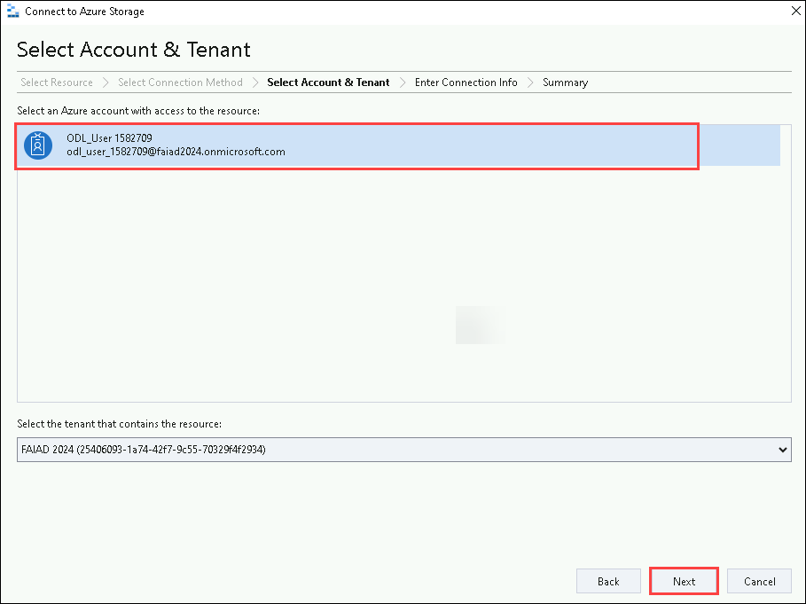

# Lab 05: Configure Microsoft Fabric Open Mirrored Databases

### Lab Scenario

In this lab, you will configure open mirrored databases within Microsoft Fabric. Your goal is to set up data replication between different database environments, ensuring high availability and fault tolerance. By the end of this lab, you will have configured open mirrored databases in Microsoft Fabric, enabling seamless data synchronization, real-time access, and improved system reliability across regions or services.

## Lab objectives
In this lab, you will complete the following tasks:

- Task 01: Create an Open mirrored database
- Task 02: Write Change Data to the Landing Zone and Monitor the Replication Process

## Estimated time: 50 minutes

## Task 01: Create an Open mirrored database 

In this task, you will create an open mirrored database in Microsoft Fabric to enable real-time data synchronization and high availability across different environments.

1. Navigate to the **Fabric portal** home.

    

2. Open an existing workspace **fabric-<inject key="DeploymentID" enableCopy="false"/> (1)**

3. In the navigation menu, select **+ New Item (2)**.

    

4. Locate and select the **Mirrored Database (preview)** card.

    

5. Enter a name for the new mirrored database as **Mirrored Database_<inject key="DeploymentID" enableCopy="false"/>** and Select **Create**.

      

6. Locate the **Landing zone URL** in the details section of the mirrored database home page and copy it.

     

## Task 02: Write Change Data to the Landing Zone and Monitor the Replication Process.

In this task, you will write change data to the landing zone and monitor the replication process to ensure data consistency and successful synchronization.

1. In the Windows search bar, type **Azure Storage Explorer** and open the application.

   

2. Click on **Sign-in with azure** .

   

3. In the **Which Azure environment would you like to sign in to?** window, select **Azure**, and click on **Next**.

    

4. On the **sign-in** page, select the account **<inject key="AzureAdUserEmail"></inject>**. A pop-up will prompt you to close the window. After logging in, Once you're logged in, close the pop-up and return to **Azure Storage Explorer**.

    

5. You'll be able to view the resources, resource groups, and subscriptions.

    

6. Click on **Connect** in the left-hand pane.

    

7. In the **Select resources** window, choose the **ADLS Gen2 container or directory**.

    

8. In the **Select connection method** window, select **Sign in using OAuth**, then click **Next**.

   

9. On the **Select Account & Tenant** window, choose the account **<inject key="AzureAdUserEmail"></inject>** and click on **Next**.

    

10. In the **Enter Connection Info** window, name it **Fabric_mirroring (1)** paste the **landing URL (2)** that you copied in Task 1 and **click** on **Next (3)**.

    

11. In the **Summary** pane, review the settings and click **Connect**.

     
     

12. Click on **Files (1)**, then select the **LandingZone (2)** folder.

     

13. From the toolbar, select **+New Folder (1)**, name it **source_employee (2)** and Click **Ok**.

     

14. Now, you will be able to see the newly created folder **source_employee**.

     

15. Select **Upload (1)**, then from the drop-down menu, choose **Upload files (2)** to upload the files to the folder.

    

16. Now, in the **Upload Files** pane, **select the "..."** (ellipsis) that's highlighted. As it helps to browse and select files from the File Explorer.

    

17. Go to the path**C:\Downloads\Labfiles**, **select** the **`metadata.json`(1)** file, and **open(2)** it to upload.

     

18. Navigate Back to the **Mirrored Database_<inject key="DeploymentID" enableCopy="false"/>** in fabric portal .

19. In the **Monitor Replication** blade, **click on Refresh**. You will be able to see the **source_employee** folder that has been created but is yet to succeed. You can ignore the warning.

    

    > **Note:** The process may take 2-5 minutes. Use Monitor replication to track the status.

    > **Note:** If the tables and replication status are not visible immediately, wait a few seconds and refresh the panel.

20. Go back to the Storage explorer and Select **Upload (1)**, then from the drop-down menu, choose **Upload files (2)** to upload the files to the folder.

    

21. In the **Upload Files** pane, **select** the **"..."** (ellipsis) to browse for files. Then, go to **C:\Downloads\Labfiles**, **select** the **`00000000....1.parquet`** file, and **open** it to upload.
   
     

22. Leave all the settings as default in the **Upload Files** pane and click **Upload**.

     

23. In Azure Storage Explorer, you will see a **success message** once the upload is complete.

   

24. In the **Monitor Replication** blade of fabric, **click on Refresh**. You will see the **source_employee** folder that has been created, with the count displayed as **3**.

     

25. Now return to **Storage Explorer** and click on **Upload** again to upload the **0000000....2.parquet** file. After the upload is complete  go to the **Monitor Replication** in Fabric, click **Refresh** and you should see the count increase. 

    

26. Choose **Query in T-SQL** from the **Monitor Replication** blade.

    

27. Click on **Refresh**, then expand **Schema** > **dbo** > **Tables**. You will see the **source_employee** table. From the three ellipses, choose **New Query**, and then select **TOP 100**.

     

28. In the **Results** pane, you will see the results displaying the **Employee ID** and **Location**.

     

29. Now, return to **Storage Explorer**, click **Upload** again to upload the **0000000....3.parquet** file. Once the upload is complete, go to the **Monitor Replication** in Fabric, click **Refresh**, and you should see the count increase. 

    

30. Select **Query in T-SQL** again from the **Monitor Replication** blade.

    

31. Run the query again that's already open. You will see only two employee IDs and their details because the last parquet file you uploaded is intended to delete the row.

    

## Summary:

In this lab, you have accomplished the following:

- **Created an open mirrored database** to enable real-time data synchronization across different environments.
- **Written change data to the landing zone** and **monitored the replication process** to ensure successful data synchronization and consistency.

### Congratulations! You have successfully finished the lab.

