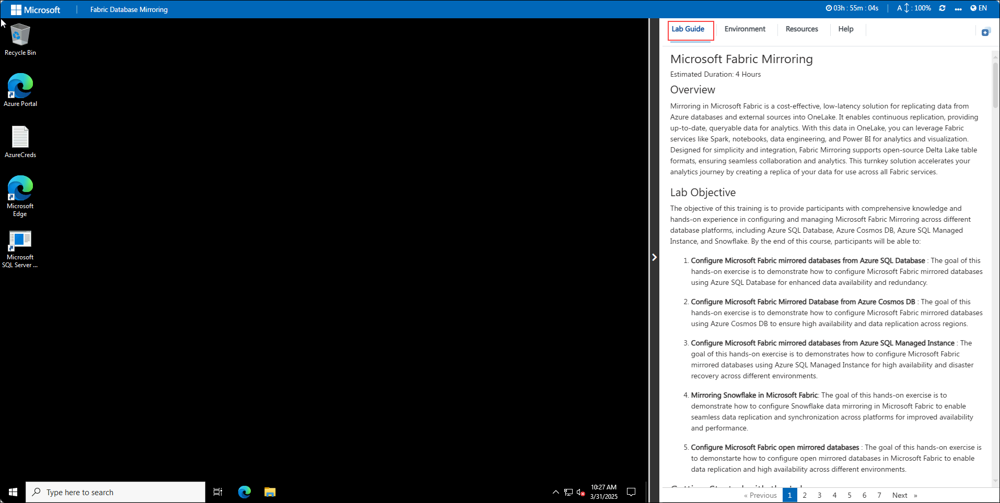
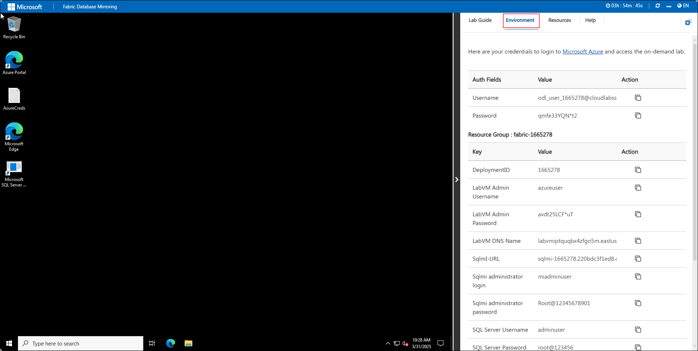
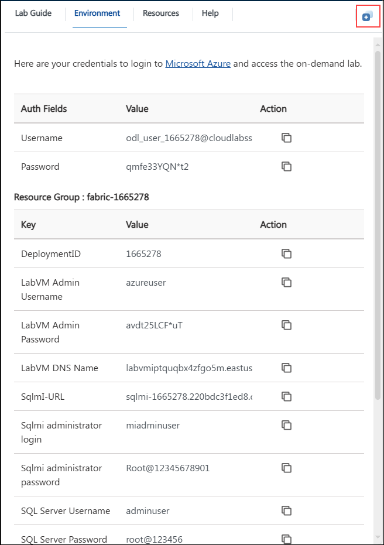
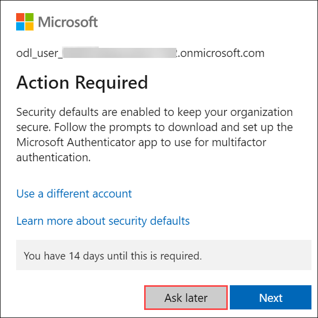
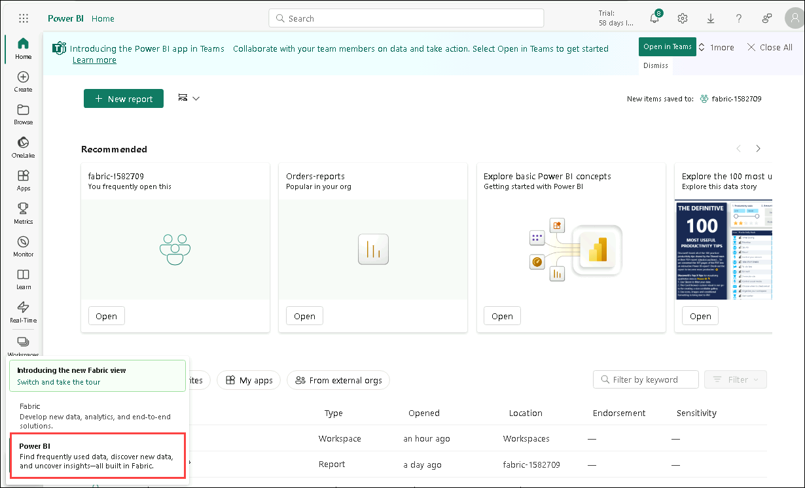
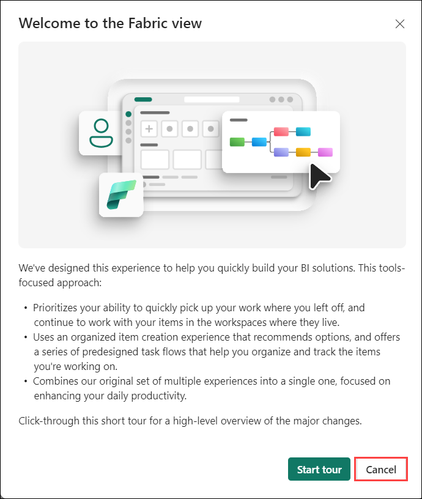

# Fabric Database Mirroring

####  Estimated Duration: 4 Hours

## Overview

Mirroring in Microsoft Fabric is a cost-effective, low-latency solution for replicating data from Azure databases and external sources into OneLake. It enables continuous replication, providing up-to-date, queryable data for analytics. With this data in OneLake, you can leverage Fabric services like Spark, notebooks, data engineering, and Power BI for analytics and visualization. Designed for simplicity and integration, Fabric Mirroring supports open-source Delta Lake table formats, ensuring seamless collaboration and analytics. This turnkey solution accelerates your analytics journey by creating a replica of your data for use across all Fabric services.

## Lab Objective

The objective of this training is to provide participants with comprehensive knowledge and hands-on experience in configuring and managing Microsoft Fabric Mirroring across different database platforms, including Azure SQL Database, Azure Cosmos DB, Azure SQL Managed Instance, and Snowflake. By the end of this course, participants will be able to:

1. **Configure Microsoft Fabric mirrored databases from Azure SQL Database** : The goal of this hands-on exercise is to demonstrate how to configure Microsoft Fabric mirrored databases using Azure SQL Database for enhanced data availability and redundancy.

2. **Configure Microsoft Fabric Mirrored Database from Azure Cosmos DB** : The goal of this hands-on exercise is to demonstrate how to configure Microsoft Fabric mirrored databases using Azure Cosmos DB to ensure high availability and data replication across regions.

3. **Configure Microsoft Fabric mirrored databases from Azure SQL Managed Instance** : The goal of this hands-on exercise is to demonstrates how to configure Microsoft Fabric mirrored databases using Azure SQL Managed Instance for high availability and disaster recovery across different environments.

4. **Mirroring Snowflake in Microsoft Fabric**: The goal of this hands-on exercise is to demonstrate how to configure Snowflake data mirroring in Microsoft Fabric to enable seamless data replication and synchronization across platforms for improved availability and performance.

5. **Configure Microsoft Fabric open mirrored databases** : The goal of this hands-on exercise is to demonstarte how to configure open mirrored databases in Microsoft Fabric to enable data replication and high availability across different environments.

## Getting Started with the Lab

Welcome to the "**Microsoft Fabric Mirroring**" lab. In this lab, you'll learn how to configure and manage mirrored databases using Microsoft Fabric across various platforms like Azure SQL, Azure Cosmos DB, SQL Managed Instance, and Snowflake. You'll gain hands-on experience in setting up, monitoring, and securing database mirroring processes. By the end, you'll have the skills to ensure data availability and synchronization across your systems.

## Accessing Your Lab Environment
 
Once you're ready to dive in, your virtual machine and lab guide will be right at your fingertips within your web browser.
 

## Virtual Machine & Lab Guide
 
Your virtual machine is your workhorse throughout the workshop. The lab guide is your roadmap to success.
 
## Exploring Your Lab Resources
 
To get a better understanding of your lab resources and credentials, navigate to the **Environment** tab.
 

 
## Utilizing the Split Window Feature
 
For convenience, you can open the lab guide in a separate window by selecting the **Split Window** button from the Top right corner.
 

 
## Managing Your Virtual Machine
 
Feel free to start, stop, or restart your virtual machine as needed from the **Resources** tab. Your experience is in your hands!
 

## Lab Guide Zoom In/Zoom Out

1. To adjust the zoom level for the environment page, click the **A↕ : 100%** icon located next to the timer in the lab environment.

   

## Let's Get Started with Azure Portal
 
1. On your virtual machine, click on the Azure Portal icon as shown below:

   .png)
 
1. You'll see the **Sign into Microsoft Azure** tab. Here, enter your credentials:
 
   - **Email/Username:** <inject key="AzureAdUserEmail"></inject>
 
       
 
4. Next, provide your password:
 
    - **Password :** <inject key="AzureAdUserPassword"></inject>
 
       

5. If you see the pop-up Action Required, click Ask Later.

   
    
   > **NOTE**: Do not enable MFA, select Ask Later.
 
7. If prompted to stay signed in, you can click "No."
 
8. If a **Welcome to Microsoft Azure** pop-up window appears, simply click **Cancel** to skip the tour.
 
# Login to fabric portal

1. Open the **Microsoft Edge browser** on your desktop and visit `https://app.fabric.microsoft.com/` in Incognito mode. You will be navigated to the login page.

     

1. Enter the following email/username, and then click on **Submit**.  

     - **Username/Email**: <inject key="AzureAdUserEmail"></inject>

        

     - **Password :** <inject key="AzureAdUserPassword"></inject>

1. Click **Sign in** and follow the prompts to sign into Fabric.

1. You will be directed to the **Fabric Home**, where you can select **Power BI** from the bottom left.

     

1. On the **Welcome to Fabric view** screen, click **Close**.

   

## Support Contact

The CloudLabs support team is available 24/7, 365 days a year, via email and live chat to ensure seamless assistance at any time. We offer dedicated support channels tailored specifically for both learners and instructors, ensuring that all your needs are promptly and efficiently addressed.

Learner Support Contacts:

- Email Support: cloudlabs-support@spektrasystems.com
- Live Chat Support: https://cloudlabs.ai/labs-support

Now, click on **Next** from the lower right corner to move on to the next page.

## Happy Learning!!
