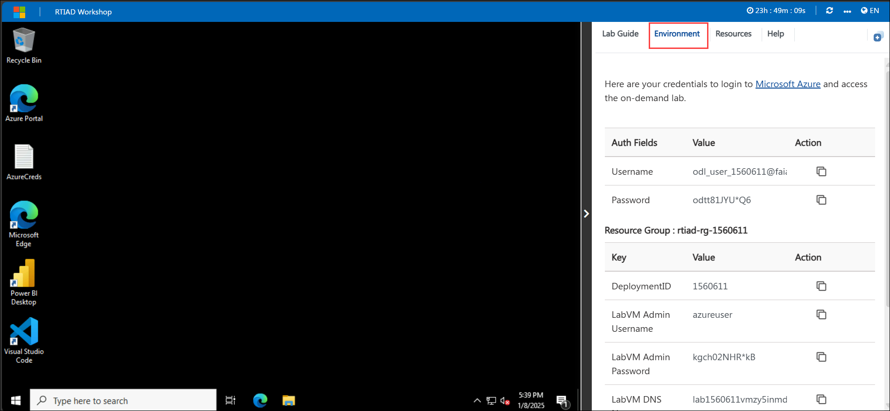
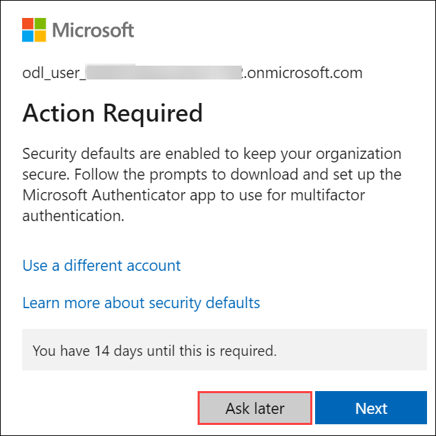
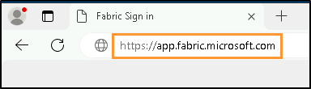
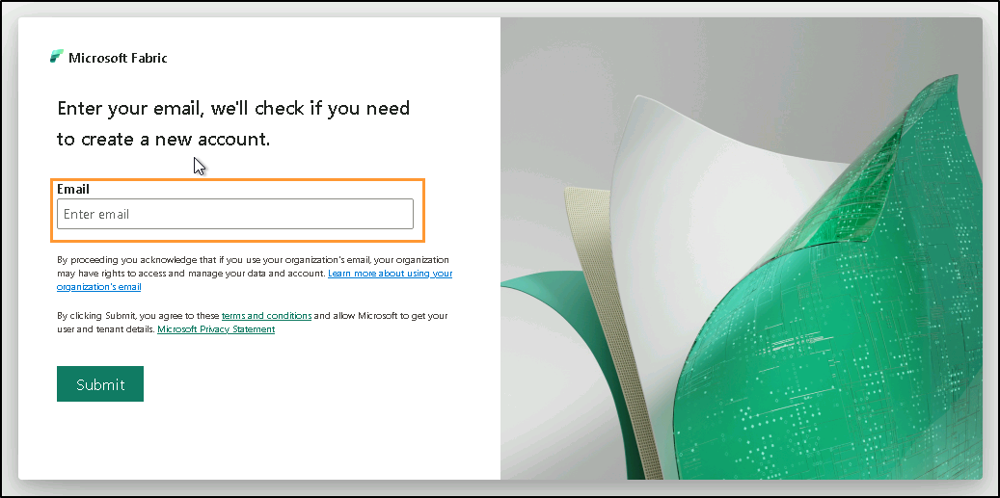

# Microsoft Fabric Mirroring

## Overview
Mirroring in Microsoft Fabric is a cost-effective, low-latency solution for replicating data from Azure databases and external sources into OneLake. It enables continuous replication, providing up-to-date, queryable data for analytics. With this data in OneLake, you can leverage Fabric services like Spark, notebooks, data engineering, and Power BI for analytics and visualization. Designed for simplicity and integration, Fabric Mirroring supports open-source Delta Lake table formats, ensuring seamless collaboration and analytics. This turnkey solution accelerates your analytics journey by creating a replica of your data for use across all Fabric services.

## Objective
The objective of this training is to provide participants with comprehensive knowledge and hands-on experience in configuring and managing Microsoft Fabric Mirroring across different database platforms, including Azure SQL Database, Azure Cosmos DB, Azure SQL Managed Instance, and Snowflake. By the end of this course, participants will be able to:

1. Understand the concepts of Microsoft Fabric Mirroring, including its types and features.

2. Configure and manage mirrored databases in Microsoft Fabric from various sources such as Azure SQL Database, Azure Cosmos DB, Azure SQL Managed Instance, and Snowflake.

3. Enable and monitor the mirroring process in the Fabric portal, ensuring data synchronization and security.

4. Implement the process of querying and analyzing data from both source and target mirrored databases.

5. Apply best practices for securing and optimizing mirrored database configurations.

6. Gain practical experience through step-by-step instructions on setting up mirroring and troubleshooting common issues.

This training will equip participants with the necessary skills to configure, monitor, and secure mirrored databases within Microsoft Fabric to enhance data availability, consistency, and performance across different platforms.

## Getting Started with the Lab

Welcome to the "**Microsoft Fabric Mirroring**" lab. In this lab, you'll learn how to configure and manage mirrored databases using Microsoft Fabric across various platforms like Azure SQL, Azure Cosmos DB, SQL Managed Instance, and Snowflake. You'll gain hands-on experience in setting up, monitoring, and securing database mirroring processes. By the end, you'll have the skills to ensure data availability and synchronization across your systems.

## Accessing Your Lab Environment
 
Once you're ready to dive in, your virtual machine and lab guide will be right at your fingertips within your web browser.
 

## Virtual Machine & Lab Guide
 
Your virtual machine is your workhorse throughout the workshop. The lab guide is your roadmap to success.
 
## Exploring Your Lab Resources
 
To get a better understanding of your lab resources and credentials, navigate to the **Environment** tab.
 

 
## Utilizing the Split Window Feature
 
For convenience, you can open the lab guide in a separate window by selecting the **Split Window** button from the Top right corner.
 

 
## Managing Your Virtual Machine
 
Feel free to start, stop, or restart your virtual machine as needed from the **Resources** tab. Your experience is in your hands!
 

## Lab Guide Zoom In/Zoom Out

1. To adjust the zoom level for the environment page, click the **A↕ : 100%** icon located next to the timer in the lab environment.

   

## Let's Get Started with Azure Portal
 
1. On your virtual machine, click on the Azure Portal icon as shown below:

   .png)
 
1. You'll see the **Sign into Microsoft Azure** tab. Here, enter your credentials:
 
   - **Email/Username:** <inject key="AzureAdUserEmail"></inject>
 
       
 
4. Next, provide your password:
 
   - **Password:** <inject key="AzureAdUserPassword"></inject>
 
       

5. If you see the pop-up Action Required, click Ask Later.

   
    
   > **NOTE**: Do not enable MFA, select Ask Later.
 
7. If prompted to stay signed in, you can click "No."
 
8. If a **Welcome to Microsoft Azure** pop-up window appears, simply click **Cancel** to skip the tour.
 

 
# Login to fabric portal

1. Open the **Microsoft Edge browser** on your desktop and visit `https://app.fabric.microsoft.com/` in Incognito mode. You will be navigated to the login page.

    

1. Enter the following email/username, and then click on **Submit**.  

    - **Username/Email**:<inject key="AzureAdUserEmail"></inject>

      

    - **Password**:<inject key="AzureAdUserPassword"></inject>

1. Click **Sign in** and follow the prompts to sign into Fabric.

1. You will be navigated to the **Fabric Home**.

    

## Support Contact

The CloudLabs support team is available 24/7, 365 days a year, via email and live chat to ensure seamless assistance at any time. We offer dedicated support channels tailored specifically for both learners and instructors, ensuring that all your needs are promptly and efficiently addressed.

Learner Support Contacts:

- Email Support: cloudlabs-support@spektrasystems.com
- Live Chat Support: https://cloudlabs.ai/labs-support

Now, click on **Next** from the lower right corner to move on to the next page.

.png)

## Happy Learning!!
