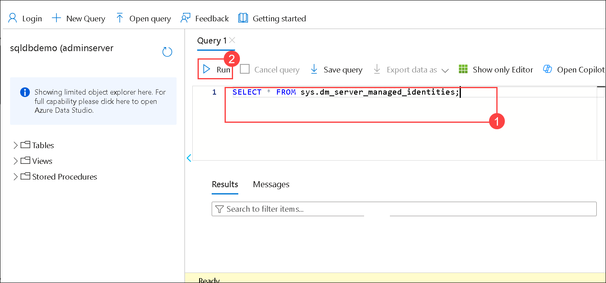
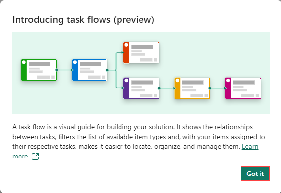
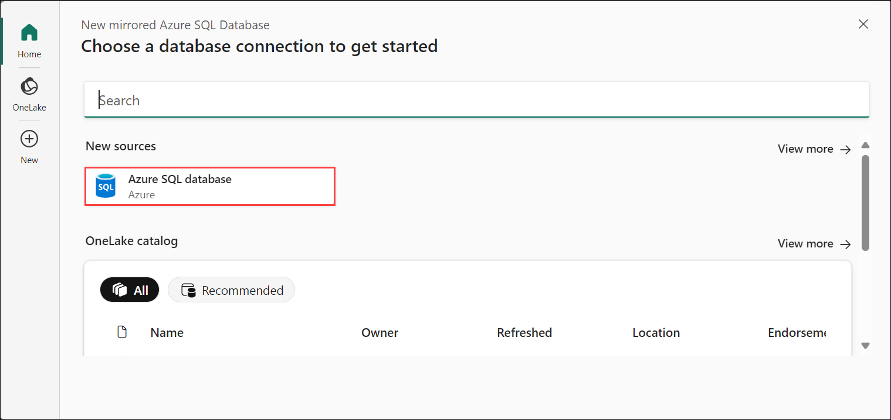
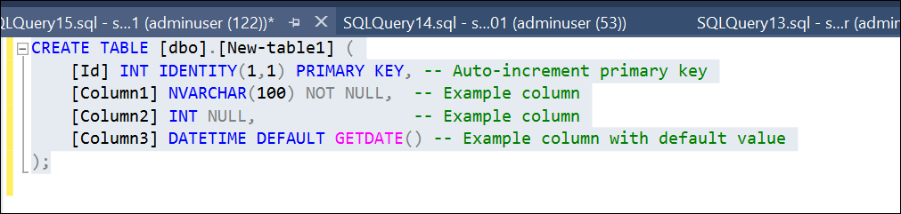
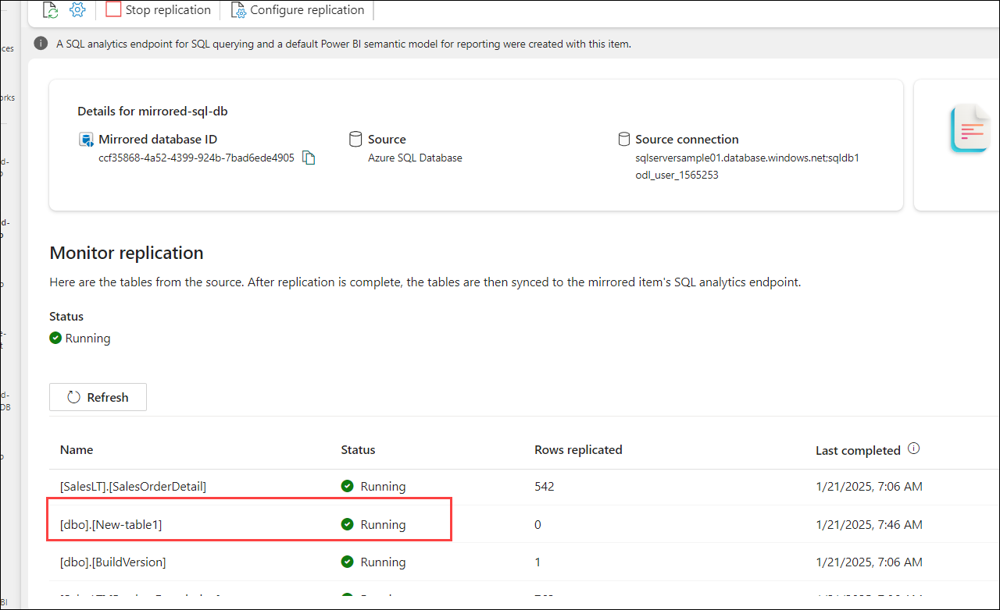

# Configure Microsoft Fabric mirrored databases from Azure SQL Database 

In this lab, the focus is on enabling SQL Analytics Monitoring Integration (SAMI) for Azure SQL Database to ensure high availability and disaster recovery. The lab guides you through the process of connecting to your Azure SQL logical server using SQL Server Management Studio (SSMS) or Visual Studio Code. You will configure a mirrored Azure SQL Database to provide a reliable failover solution. The mirroring setup ensures that your data is synchronized between the primary and mirrored databases, providing resilience in case of failure. By completing this lab, you gain practical knowledge of how to enhance the availability and security of your Azure SQL Database.

## Enable SAMI of your Azure SQL logical server

1. In the azure portal , search for the SQL server
   
   

1. Select the SQL servers. 

   

1. To enable or verify the System Assigned Managed Identity (SAMI), navigate to your logical SQL Server in the Azure portal. Under the Security section in the resource menu, select Identity, and then set the Status to "On."

   

3. Go back to your query-editor, on query editor preview, login to sql server with server autentication 

   - Username : `adminserver`

   - Password : `Root@12345`

   

2. The SAMI must be the primary identity. Verify the SAMI is the primary identity with the following T-SQL query: 

   ```
   SELECT * FROM sys.dm_server_managed_identities;
   ```

   

    


## Connect to your Azure SQL logical server using SQL Server Management Studio (SSMS) Connect to the master database.

1. Login to sql server , add the below creds :

   - Server name : 

   - Authentication : 

   - Login : 

   - Password : 

      

1. Create a server login and assign the appropriate permissions.


1. Create a SQL Authenticated login named fabric_login. You can choose any name for this login. Provide your own strong password. Run the following T-SQL script in the master database by right clicking and selecting the new query

- Provide the "strong password" as desired

  
     ```
     CREATE LOGIN fabric_login WITH PASSWORD = '<strong password>';
     ALTER SERVER ROLE [##MS_ServerStateReader##] ADD MEMBER fabric_login;
     ```

   

4. You will be able to see a fabric_login that's been created under logins 

    

1. Connect to the Azure SQL Database your plan to mirror to Microsoft Fabric, using the Azure portal query editor, SQL Server Management Studio (SSMS), Create a database user connected to the login: 

     ```
     CREATE USER fabric_user FOR LOGIN fabric_login;
     ```

# Create a mirrored Azure SQL Database

1. Open the [Fabric portal](https://app.fabric.microsoft.com/home), You will be navigated to the **Fabric Home**.

    

    To work with Fabric items, you will need a trial license and a workspace that has Fabric license. Let’s set this up.

1. On the top right corner of the screen, select the **user** **icon**.

1. Select **Free Trial**.

    

1. Upgrade to a free Microsoft Fabric trial dialog opens. Select **Activate**.

    

1. The "Successfully Upgraded to Microsoft Fabric" dialog will appear. Click on **Fabric Home Page**..  

   

1. You will be navigated back to the **Microsoft** **Fabric Home page**.

    

1. Now let’s create a workspace with Fabric license. 

1.  Now, select **Workspaces** and click on **+ New workspace**:

     

2. Fill out the **Create a workspace** form with the following details:

   - **Name:** Enter **fabric-<inject key="DeploymentID" enableCopy="false"/>**.

      
   
   >**Note**: The user ID will be unique for each user, and the workspace name must also be unique. Ensure that a green check mark with **"This name is available"** appears below the Name field.

1. If you would like, you can enter a **Description** for the workspace. This is an optional field.

1. Click on **Advanced** to expand the section.

1. Under **License mode**, make sure **Trial** is selected,Select **Apply** to create a new workspace.

    

    >**Note:** If the **Introducing task flows** dialog opens, click on **Got it**.

    

1. Navigate to the workspace. Select the **+New item** icon.

    

1. Scroll to the Data Warehouse section and then select **Mirrored Azure SQL Database**.

   
  
1. Enter the **MirroredDatabase_<inject key="DeploymentID" enableCopy="false"/>****. Azure SQL Database to be mirrored, then select Create.

   


# Connect to your Azure SQL Database

1. Select a Azure SQL Database under **choose a database connection to get started**.

   


2. Select New connection, enter the connection details to the Azure SQL Database.

  - Server: 
  - Database: 
  - Connection: Create new connection.
  - Connection name: 
  - Authentication kind:
    - Basic (SQL Authentication)
  - Select Connect.

     

 3. On the choose data pane , review that by default its selected all. 

     

 # Start mirroring process

1.  The Configure mirroring screen allows you to mirror all data in the database, by default.

2. Select Mirror database. Mirroring begins.

    

3. Wait for 2-5 minutes. Then, select Monitor replication to see the status.

4. After a few minutes, the status should change to Running, which means the tables are being synchronized.

     

6. Open SQL Server Management Studio (SSMS), navigate to the toolbar, click on **New Query**, and paste the following code to create a table for mirroring.

   ```
   CREATE TABLE [dbo].[YourNewTableName] (
    [Id] INT IDENTITY(1,1) PRIMARY KEY, -- Auto-increment primary key
    [Column1] NVARCHAR(100) NOT NULL,  -- Example column
    [Column2] INT NULL,                -- Example column
    [Column3] DATETIME DEFAULT GETDATE() -- Example column with default value);

    ```

    

   7. You can view the newly created database under the list of databases in the database explorer.

      

   8. Return to the Fabric environment, navigate to the mirrored database, and refresh it. You should be able to see the newly created table.

      
     

   >**Note**: If you don't see the tables and the corresponding replication status, wait a few seconds and then refresh the panel.

5. When they have finished the initial copying of the tables, a date appears in the Last refresh column.

# Review

In this lab, you have learned how to enable SAMI for your Azure SQL logical server by connecting via SQL Server Management Studio (SSMS) or Visual Studio Code with the mssql extension. After connecting to the master database, you proceed to set up and configure a mirrored Azure SQL Database. This setup ensures high availability by creating a replica of the database for failover scenarios. The process involves configuring database mirroring to maintain data synchronization between the primary and mirrored databases. Overall, the lab helps you establish disaster recovery and resilience for your Azure SQL Database environments.


